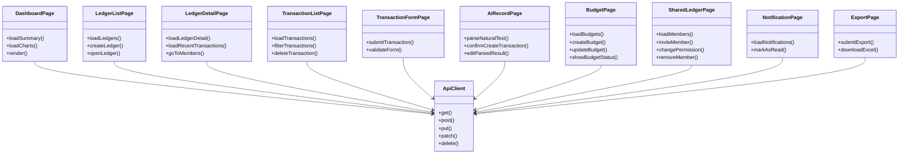
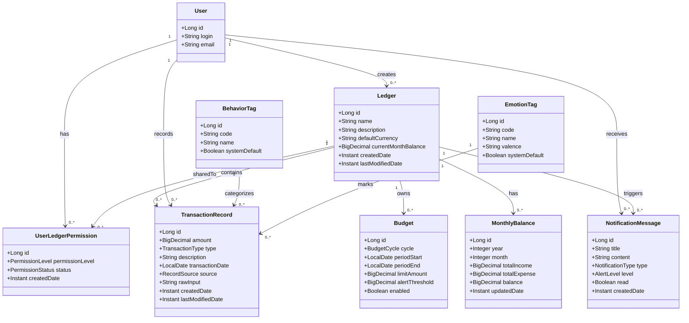
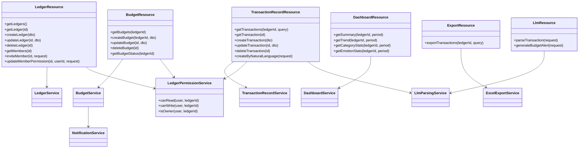
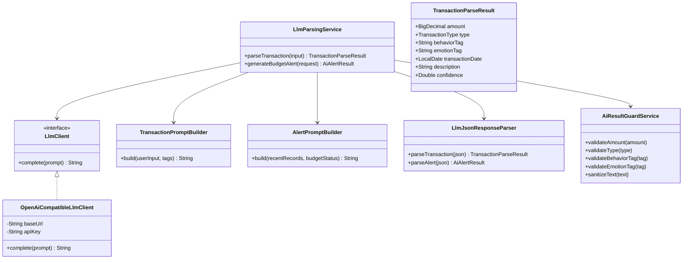
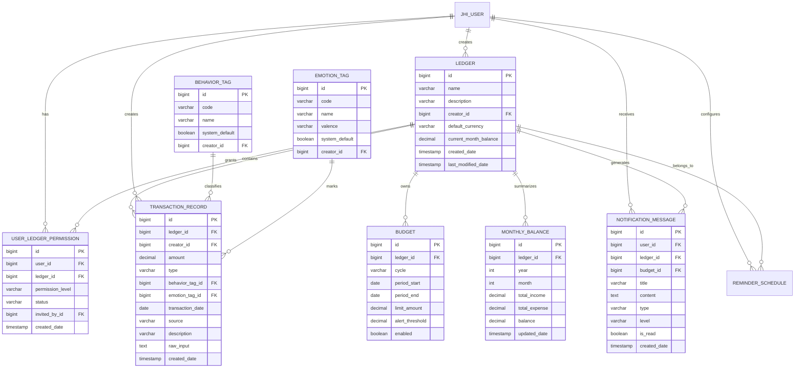
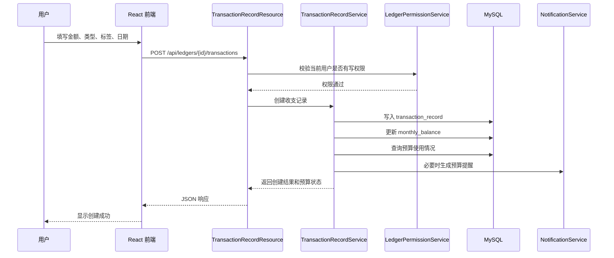
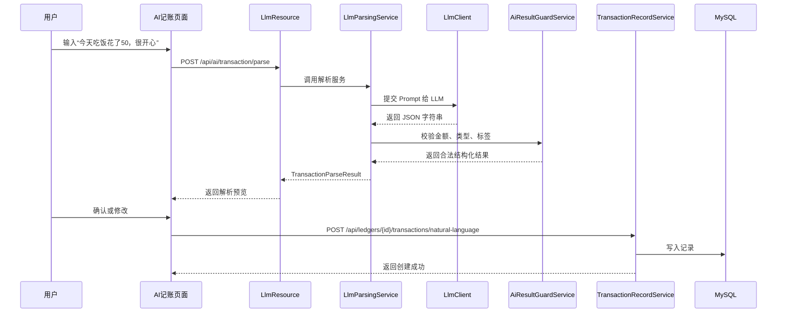
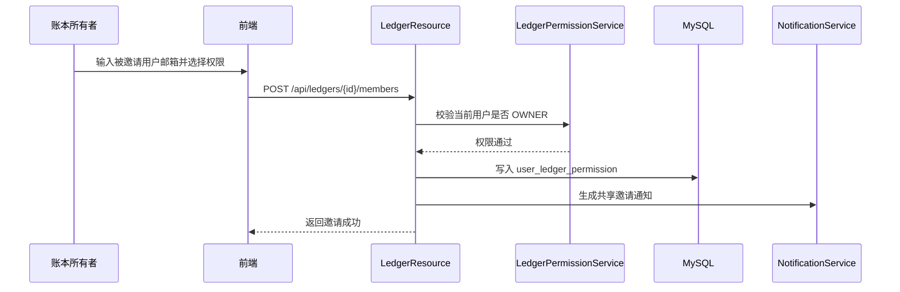

# EveryCent 智能记账系统详细设计文档

> 建议保存路径：`docs/system-design.md`  
> 适用项目：EveryCent 智能记账系统  
> 技术基座：JHipster Monolithic Application + Spring Boot + React + MySQL + JWT  
> 设计目标：用于课程设计中的体系结构设计、类图设计、前后端功能拆分、数据库建模、API 定义和后续实现分工。

---

## 1. 项目概述

EveryCent 是一个具有 AI 辅助功能的智能记账系统，面向希望控制消费、分析消费行为、记录情绪状态并进行预算约束的用户。系统支持传统表单记账和自然语言记账两种方式，同时提供多账本共享、预算告警、消费数据看板、Excel 导出和消息提醒等功能。

本项目采用 JHipster 生成的单体应用结构。虽然运行时是一个 Spring Boot 应用，但开发逻辑上可以划分为前端表示层、后端业务层、数据库持久层和 LLM 智能控制层。

---

## 2. 系统目标与核心功能

### 2.1 核心目标

1. 降低记账门槛，支持自然语言快速记账。
2. 对用户消费行为进行结构化管理。
3. 通过预算与告警机制提醒用户控制支出。
4. 支持多账本共享，满足家庭、情侣、监督等场景。
5. 通过数据看板呈现收入、支出、余额、分类占比和消费趋势。
6. 通过 AI 自动识别行为标签、情绪标签，并生成个性化提醒。
7. 保证用户之间的数据隔离、账本权限控制和数据库完整性。

### 2.2 功能模块划分

| 模块 | 主要功能 |
|---|---|
| 用户与认证模块 | 注册、登录、JWT 鉴权、当前用户信息 |
| 账本模块 | 创建账本、查看账本、编辑账本、删除账本、账本共享 |
| 权限模块 | 账本所有者、只读成员、读写成员、权限校验 |
| 收支记录模块 | 表单记账、自然语言记账、修改记录、删除记录、查询筛选 |
| 标签模块 | 行为标签、情绪标签、AI 自动识别、标签筛选 |
| 预算模块 | 周预算、月预算、预算剩余、超支检测、预算告警 |
| 数据看板模块 | 总收入、总支出、余额、分类占比、情绪分布、趋势图 |
| 导出模块 | 按账本、时间范围导出 Excel |
| 消息提醒模块 | 预算超支提醒、定时记账提醒、账本共享提醒 |
| LLM 模块 | 自然语言解析、标签识别、个性化预算提醒生成 |
| 管理与文档模块 | API 文档、项目结构说明、团队协作文档 |

---

## 3. 推荐项目目录结构

JHipster 项目不建议强行拆成独立的 `frontend/`、`backend/`、`database/`、`llm/` 目录，而应保留原有结构，并在原结构内增加业务模块目录。

```text
EveryCent/
├── src/
│   ├── main/
│   │   ├── java/com/everycent/
│   │   │   ├── config/
│   │   │   ├── domain/
│   │   │   ├── repository/
│   │   │   ├── security/
│   │   │   ├── service/
│   │   │   ├── service/dto/
│   │   │   ├── service/mapper/
│   │   │   ├── web/rest/
│   │   │   └── llm/
│   │   │       ├── client/
│   │   │       ├── dto/
│   │   │       ├── prompt/
│   │   │       └── parser/
│   │   ├── resources/
│   │   │   └── config/liquibase/
│   │   └── webapp/
│   │       └── app/
│   │           ├── modules/everycent/
│   │           │   ├── dashboard/
│   │           │   ├── ledger/
│   │           │   ├── transaction/
│   │           │   ├── budget/
│   │           │   ├── ai-record/
│   │           │   ├── shared-ledger/
│   │           │   ├── notification/
│   │           │   └── export/
│   │           ├── shared/
│   │           └── config/
│   └── test/
├── docs/
│   ├── system-design.md
│   ├── project-structure.md
│   ├── team-workflow.md
│   ├── api-design.md
│   ├── database-design.md
│   ├── llm-design.md
│   └── test-plan.md
├── .jhipster/
├── pom.xml
├── package.json
├── README.md
└── .env.example
```

---

## 4. 前端功能设计

前端基于 React + TypeScript 实现，主要承担用户界面、表单交互、接口调用、图表展示和用户操作反馈。

### 4.1 前端总体功能

| 页面/模块 | 路由建议 | 功能说明 |
|---|---|---|
| 首页/概览页 | `/everycent/dashboard` | 展示当前账本收入、支出、余额、预算状态和图表 |
| 账本列表页 | `/everycent/ledgers` | 查看用户拥有或参与的账本 |
| 账本详情页 | `/everycent/ledgers/:id` | 查看账本基本信息和最近记录 |
| 创建/编辑账本页 | `/everycent/ledgers/new`、`/everycent/ledgers/:id/edit` | 创建账本、修改账本名称、描述、默认货币 |
| 收支记录列表页 | `/everycent/ledgers/:id/transactions` | 查看、筛选、搜索、分页显示收支记录 |
| 表单记账页 | `/everycent/ledgers/:id/transactions/new` | 手动输入金额、类型、标签、时间、备注 |
| 自然语言记账页 | `/everycent/ai-record` | 输入一句话，由 AI 解析为结构化消费记录 |
| 预算管理页 | `/everycent/ledgers/:id/budgets` | 设置周预算、月预算，查看预算使用情况 |
| 账本共享页 | `/everycent/ledgers/:id/members` | 邀请成员、设置只读/读写权限、移除成员 |
| 数据分析页 | `/everycent/ledgers/:id/analytics` | 收支趋势、分类占比、情绪标签分布 |
| 消息提醒页 | `/everycent/notifications` | 查看预算提醒、共享提醒、记账提醒 |
| Excel 导出页 | `/everycent/ledgers/:id/export` | 选择时间范围并导出 Excel |
| 标签管理页 | `/everycent/tags` | 查看行为标签和情绪标签 |
| 个人设置页 | `/account/settings` | 使用 JHipster 原生账户设置能力 |

---

### 4.2 前端组件设计

```text
src/main/webapp/app/modules/everycent/
├── dashboard/
│   ├── dashboard.tsx
│   ├── summary-card.tsx
│   ├── expense-pie-chart.tsx
│   ├── income-expense-line-chart.tsx
│   └── budget-warning-card.tsx
├── ledger/
│   ├── ledger-list.tsx
│   ├── ledger-detail.tsx
│   ├── ledger-form.tsx
│   └── ledger-api.ts
├── transaction/
│   ├── transaction-list.tsx
│   ├── transaction-form.tsx
│   ├── transaction-filter.tsx
│   ├── transaction-detail.tsx
│   └── transaction-api.ts
├── ai-record/
│   ├── ai-record-page.tsx
│   ├── parse-preview-card.tsx
│   └── ai-record-api.ts
├── budget/
│   ├── budget-list.tsx
│   ├── budget-form.tsx
│   ├── budget-progress.tsx
│   └── budget-api.ts
├── shared-ledger/
│   ├── member-list.tsx
│   ├── invite-member-modal.tsx
│   └── permission-selector.tsx
├── notification/
│   ├── notification-list.tsx
│   └── notification-api.ts
└── export/
    ├── export-page.tsx
    └── export-api.ts
```

---

### 4.3 前端类图/组件关系图

React 项目本质上以组件和 Hook 为主，不完全是传统面向对象类图。课程设计中可以将页面组件、API 封装和数据模型作为前端类图描述。



---

## 5. 后端功能设计

后端基于 Spring Boot + JHipster，主要负责 REST API、JWT 鉴权、业务逻辑、权限校验、数据持久化、LLM 调用和 Excel 导出。

### 5.1 后端模块划分

| 后端模块 | 主要类 | 职责 |
|---|---|---|
| 用户认证模块 | JHipster AccountResource、UserJWTController | 注册、登录、JWT、当前用户信息 |
| 账本模块 | LedgerResource、LedgerService、LedgerRepository | 账本 CRUD、账本详情 |
| 权限模块 | LedgerPermissionService、UserLedgerPermissionRepository | 判断用户是否可读、可写、是否为所有者 |
| 收支记录模块 | TransactionRecordResource、TransactionRecordService | 收支记录 CRUD、筛选、余额更新 |
| 标签模块 | TagResource、BehaviorTagRepository、EmotionTagRepository | 行为标签、情绪标签 |
| 预算模块 | BudgetResource、BudgetService | 预算 CRUD、预算状态计算、超支检测 |
| 数据看板模块 | DashboardResource、DashboardService | 聚合统计、图表数据 |
| 导出模块 | ExportResource、ExcelExportService | Excel 账单导出 |
| 通知模块 | NotificationResource、NotificationService | 消息提醒、已读状态 |
| LLM 模块 | LlmResource、LlmParsingService、LlmClient | 自然语言解析、AI 提醒生成 |
| 风险控制模块 | ValidationService、AiResultGuardService | AI 结果校验、金额和标签合法性校验 |

---

### 5.2 Java 包结构设计

建议在 JHipster 原有包基础上扩展：

```text
com.everycent
├── domain
│   ├── Ledger
│   ├── UserLedgerPermission
│   ├── TransactionRecord
│   ├── Budget
│   ├── BehaviorTag
│   ├── EmotionTag
│   ├── NotificationMessage
│   └── MonthlyBalance
├── repository
│   ├── LedgerRepository
│   ├── UserLedgerPermissionRepository
│   ├── TransactionRecordRepository
│   ├── BudgetRepository
│   ├── BehaviorTagRepository
│   ├── EmotionTagRepository
│   ├── NotificationMessageRepository
│   └── MonthlyBalanceRepository
├── service
│   ├── LedgerService
│   ├── LedgerPermissionService
│   ├── TransactionRecordService
│   ├── BudgetService
│   ├── DashboardService
│   ├── NotificationService
│   ├── ExcelExportService
│   └── dto
├── web.rest
│   ├── LedgerResource
│   ├── TransactionRecordResource
│   ├── BudgetResource
│   ├── DashboardResource
│   ├── ExportResource
│   ├── NotificationResource
│   └── LlmResource
└── llm
    ├── client
    │   ├── LlmClient
    │   └── OpenAiCompatibleLlmClient
    ├── dto
    │   ├── TransactionParseRequest
    │   ├── TransactionParseResult
    │   └── AiAlertResult
    ├── prompt
    │   ├── TransactionPromptBuilder
    │   └── AlertPromptBuilder
    └── parser
        └── LlmJsonResponseParser
```

---

## 6. 后端类图设计

### 6.1 核心领域类图



---

### 6.2 服务与控制器类图



---

### 6.3 LLM 模块类图



---

## 7. 数据库建模设计

### 7.1 数据库核心表

JHipster 已经生成用户相关表，例如：

```text
jhi_user
jhi_authority
jhi_user_authority
```

EveryCent 业务表建议如下：

1. `ledger`：账本表。
2. `user_ledger_permission`：用户账本权限表。
3. `transaction_record`：收支记录表。
4. `behavior_tag`：行为标签表。
5. `emotion_tag`：情绪标签表。
6. `budget`：预算表。
7. `monthly_balance`：月度余额快照表。
8. `notification_message`：消息提醒表。
9. `reminder_schedule`：定时提醒配置表。
10. `export_task`：导出任务表，可选。

---

### 7.2 E-R 图设计



---

### 7.3 表结构详细设计

#### 7.3.1 ledger

| 字段 | 类型 | 约束 | 说明 |
|---|---|---|---|
| id | BIGINT | PK | 主键 |
| name | VARCHAR(100) | NOT NULL | 账本名称 |
| description | VARCHAR(500) | NULL | 账本描述 |
| creator_id | BIGINT | FK, NOT NULL | 创建者，对应 `jhi_user.id` |
| default_currency | VARCHAR(10) | NOT NULL | 默认货币，例如 CNY |
| current_month_balance | DECIMAL(19,2) | NOT NULL, DEFAULT 0 | 当前月余额 |
| created_date | TIMESTAMP | NOT NULL | 创建时间 |
| last_modified_date | TIMESTAMP | NULL | 更新时间 |

索引：

```sql
idx_ledger_creator_id(creator_id)
```

---

#### 7.3.2 user_ledger_permission

| 字段 | 类型 | 约束 | 说明 |
|---|---|---|---|
| id | BIGINT | PK | 主键 |
| user_id | BIGINT | FK, NOT NULL | 被授权用户 |
| ledger_id | BIGINT | FK, NOT NULL | 账本 |
| permission_level | VARCHAR(30) | NOT NULL | OWNER、READ_WRITE、READ_ONLY |
| status | VARCHAR(30) | NOT NULL | ACTIVE、PENDING、REVOKED |
| invited_by_id | BIGINT | FK | 邀请人 |
| created_date | TIMESTAMP | NOT NULL | 授权时间 |

唯一约束：

```sql
uk_user_ledger(user_id, ledger_id)
```

权限含义：

| 权限 | 可查看 | 可新增记录 | 可修改记录 | 可删除账本 | 可邀请成员 |
|---|---|---|---|---|---|
| OWNER | 是 | 是 | 是 | 是 | 是 |
| READ_WRITE | 是 | 是 | 是 | 否 | 否 |
| READ_ONLY | 是 | 否 | 否 | 否 | 否 |

---

#### 7.3.3 transaction_record

| 字段 | 类型 | 约束 | 说明 |
|---|---|---|---|
| id | BIGINT | PK | 主键 |
| ledger_id | BIGINT | FK, NOT NULL | 所属账本 |
| creator_id | BIGINT | FK, NOT NULL | 创建用户 |
| amount | DECIMAL(19,2) | NOT NULL, CHECK > 0 | 金额 |
| type | VARCHAR(20) | NOT NULL | INCOME、EXPENSE |
| behavior_tag_id | BIGINT | FK | 行为标签 |
| emotion_tag_id | BIGINT | FK | 情绪标签 |
| transaction_date | DATE | NOT NULL | 交易日期 |
| source | VARCHAR(30) | NOT NULL | MANUAL、NATURAL_LANGUAGE |
| description | VARCHAR(500) | NULL | 描述 |
| raw_input | TEXT | NULL | 自然语言原始输入 |
| created_date | TIMESTAMP | NOT NULL | 创建时间 |
| last_modified_date | TIMESTAMP | NULL | 更新时间 |

索引：

```sql
idx_transaction_ledger_date(ledger_id, transaction_date)
idx_transaction_creator_id(creator_id)
idx_transaction_behavior_tag(behavior_tag_id)
idx_transaction_emotion_tag(emotion_tag_id)
```

---

#### 7.3.4 behavior_tag

| 字段 | 类型 | 约束 | 说明 |
|---|---|---|---|
| id | BIGINT | PK | 主键 |
| code | VARCHAR(50) | UNIQUE, NOT NULL | 标签编码，例如 FOOD |
| name | VARCHAR(50) | NOT NULL | 标签名称，例如 餐饮 |
| system_default | BOOLEAN | NOT NULL | 是否系统默认 |
| creator_id | BIGINT | FK, NULL | 自定义标签创建者 |

建议默认行为标签：

```text
FOOD 餐饮
TRANSPORT 交通
SHOPPING 购物
ENTERTAINMENT 娱乐
STUDY 学习
MEDICAL 医疗
SALARY 工资
PART_TIME 兼职
OTHER 其他
```

---

#### 7.3.5 emotion_tag

| 字段 | 类型 | 约束 | 说明 |
|---|---|---|---|
| id | BIGINT | PK | 主键 |
| code | VARCHAR(50) | UNIQUE, NOT NULL | 标签编码 |
| name | VARCHAR(50) | NOT NULL | 标签名称 |
| valence | VARCHAR(20) | NOT NULL | POSITIVE、NEUTRAL、NEGATIVE |
| system_default | BOOLEAN | NOT NULL | 是否系统默认 |
| creator_id | BIGINT | FK, NULL | 自定义标签创建者 |

建议默认情绪标签：

```text
HAPPY 开心
CALM 平静
IMPULSIVE 冲动
ANXIOUS 焦虑
REGRET 后悔
STRESSED 压力
NONE 无明显情绪
```

---

#### 7.3.6 budget

| 字段 | 类型 | 约束 | 说明 |
|---|---|---|---|
| id | BIGINT | PK | 主键 |
| ledger_id | BIGINT | FK, NOT NULL | 所属账本 |
| cycle | VARCHAR(20) | NOT NULL | WEEKLY、MONTHLY |
| period_start | DATE | NOT NULL | 周期开始 |
| period_end | DATE | NOT NULL | 周期结束 |
| limit_amount | DECIMAL(19,2) | NOT NULL | 预算金额 |
| alert_threshold | DECIMAL(5,2) | NOT NULL | 告警阈值，例如 0.80 |
| enabled | BOOLEAN | NOT NULL | 是否启用 |

唯一约束：

```sql
uk_budget_ledger_cycle_period(ledger_id, cycle, period_start, period_end)
```

---

#### 7.3.7 monthly_balance

| 字段 | 类型 | 约束 | 说明 |
|---|---|---|---|
| id | BIGINT | PK | 主键 |
| ledger_id | BIGINT | FK, NOT NULL | 所属账本 |
| year | INT | NOT NULL | 年份 |
| month | INT | NOT NULL | 月份 |
| total_income | DECIMAL(19,2) | NOT NULL | 月收入 |
| total_expense | DECIMAL(19,2) | NOT NULL | 月支出 |
| balance | DECIMAL(19,2) | NOT NULL | 月余额 |
| updated_date | TIMESTAMP | NOT NULL | 更新时间 |

唯一约束：

```sql
uk_monthly_balance_ledger_year_month(ledger_id, year, month)
```

---

#### 7.3.8 notification_message

| 字段 | 类型 | 约束 | 说明 |
|---|---|---|---|
| id | BIGINT | PK | 主键 |
| user_id | BIGINT | FK, NOT NULL | 接收用户 |
| ledger_id | BIGINT | FK | 相关账本 |
| budget_id | BIGINT | FK | 相关预算 |
| title | VARCHAR(100) | NOT NULL | 标题 |
| content | TEXT | NOT NULL | 内容 |
| type | VARCHAR(30) | NOT NULL | BUDGET_ALERT、REMINDER、SHARE_INVITE |
| level | VARCHAR(30) | NOT NULL | INFO、WARNING、DANGER |
| is_read | BOOLEAN | NOT NULL | 是否已读 |
| created_date | TIMESTAMP | NOT NULL | 创建时间 |

---

### 7.4 数据库完整性约束

| 约束类型 | 设计 |
|---|---|
| 主键约束 | 所有业务表均使用 `id` 作为主键 |
| 外键约束 | 账本、用户、记录、预算、标签之间建立外键 |
| 非空约束 | 金额、类型、日期、账本 ID、用户 ID 不允许为空 |
| 唯一约束 | 用户与账本授权唯一、预算周期唯一、标签编码唯一 |
| 检查约束 | 金额必须大于 0，预算金额必须大于 0，阈值在 0-1 之间 |
| 权限约束 | 只读用户不能新增、修改、删除记录 |
| AI 结果约束 | AI 解析结果必须通过后端校验后才能入库 |

---

### 7.5 触发器设计建议

为了满足“每次录入行为后自动计算本月余额”的需求，可以在数据库或后端 Service 中实现余额更新。课程设计中可以展示触发器方案。

#### 插入收支记录后更新月度余额

```sql
CREATE TRIGGER trg_after_transaction_insert
AFTER INSERT ON transaction_record
FOR EACH ROW
BEGIN
    -- 根据 NEW.ledger_id 和 NEW.transaction_date 定位 monthly_balance
    -- 若不存在则插入月度统计行
    -- 若 NEW.type = 'INCOME' 则增加 total_income
    -- 若 NEW.type = 'EXPENSE' 则增加 total_expense
    -- balance = total_income - total_expense
END;
```

#### 修改收支记录后重算月度余额

```sql
CREATE TRIGGER trg_after_transaction_update
AFTER UPDATE ON transaction_record
FOR EACH ROW
BEGIN
    -- 对 OLD 所属月份和 NEW 所属月份重新计算统计值
END;
```

#### 删除收支记录后重算月度余额

```sql
CREATE TRIGGER trg_after_transaction_delete
AFTER DELETE ON transaction_record
FOR EACH ROW
BEGIN
    -- 对 OLD 所属月份重新计算统计值
END;
```

实际实现时，也可以选择在 `TransactionRecordService` 中调用 `MonthlyBalanceService.recalculate(ledgerId, year, month)`，这种方式更便于调试和测试。

---

## 8. 前后端 API 定义

统一约定：

1. 所有业务接口均以 `/api` 开头。
2. 认证使用 JHipster JWT。
3. 请求和响应均使用 JSON。
4. 金额字段统一使用字符串或 decimal，避免前端浮点精度问题。
5. 日期使用 `YYYY-MM-DD`。
6. 时间使用 ISO-8601 格式。
7. 有账本维度的接口必须校验当前用户是否拥有该账本权限。

---

### 8.1 认证接口

JHipster 已自带认证接口，通常包括：

| 方法 | 路径 | 功能 |
|---|---|---|
| POST | `/api/register` | 用户注册 |
| POST | `/api/authenticate` | 用户登录，返回 JWT |
| GET | `/api/account` | 获取当前登录用户信息 |

#### 登录请求

```json
{
  "username": "admin",
  "password": "admin",
  "rememberMe": true
}
```

#### 登录响应

```json
{
  "id_token": "jwt-token"
}
```

---

### 8.2 账本接口

#### 8.2.1 获取当前用户账本列表

| 项目 | 内容 |
|---|---|
| 方法 | GET |
| 路径 | `/api/ledgers` |
| 权限 | 登录用户 |
| 功能 | 获取当前用户创建或被共享的账本 |

请求参数：

| 参数 | 类型 | 必填 | 说明 |
|---|---|---|---|
| keyword | string | 否 | 按账本名称搜索 |
| page | number | 否 | 页码 |
| size | number | 否 | 每页数量 |

响应示例：

```json
{
  "content": [
    {
      "id": 1,
      "name": "我的日常账本",
      "description": "个人消费记录",
      "defaultCurrency": "CNY",
      "currentMonthBalance": "2500.00",
      "permissionLevel": "OWNER",
      "createdDate": "2026-06-15T10:00:00Z"
    }
  ],
  "totalElements": 1
}
```

#### 8.2.2 创建账本

| 方法 | 路径 | 权限 |
|---|---|---|
| POST | `/api/ledgers` | 登录用户 |

请求：

```json
{
  "name": "家庭共享账本",
  "description": "家庭共同开销记录",
  "defaultCurrency": "CNY"
}
```

响应：

```json
{
  "id": 2,
  "name": "家庭共享账本",
  "permissionLevel": "OWNER"
}
```

#### 8.2.3 获取账本详情

```text
GET /api/ledgers/{ledgerId}
```

响应：

```json
{
  "id": 1,
  "name": "我的日常账本",
  "description": "个人消费记录",
  "defaultCurrency": "CNY",
  "currentMonthBalance": "2500.00",
  "currentUserPermission": "OWNER",
  "memberCount": 3,
  "createdDate": "2026-06-15T10:00:00Z"
}
```

#### 8.2.4 修改账本

```text
PUT /api/ledgers/{ledgerId}
```

权限：`OWNER`

请求：

```json
{
  "name": "我的新账本名称",
  "description": "新的描述",
  "defaultCurrency": "CNY"
}
```

#### 8.2.5 删除账本

```text
DELETE /api/ledgers/{ledgerId}
```

权限：`OWNER`

---

### 8.3 账本共享与权限接口

#### 8.3.1 获取账本成员

```text
GET /api/ledgers/{ledgerId}/members
```

权限：`OWNER` 或 `READ_WRITE` 或 `READ_ONLY`

响应：

```json
[
  {
    "userId": 1,
    "login": "admin",
    "email": "admin@example.com",
    "permissionLevel": "OWNER",
    "status": "ACTIVE"
  },
  {
    "userId": 2,
    "login": "user",
    "email": "user@example.com",
    "permissionLevel": "READ_ONLY",
    "status": "ACTIVE"
  }
]
```

#### 8.3.2 邀请成员

```text
POST /api/ledgers/{ledgerId}/members
```

权限：`OWNER`

请求：

```json
{
  "loginOrEmail": "user@example.com",
  "permissionLevel": "READ_ONLY"
}
```

#### 8.3.3 修改成员权限

```text
PUT /api/ledgers/{ledgerId}/members/{userId}
```

权限：`OWNER`

请求：

```json
{
  "permissionLevel": "READ_WRITE"
}
```

#### 8.3.4 移除成员

```text
DELETE /api/ledgers/{ledgerId}/members/{userId}
```

权限：`OWNER`

---

### 8.4 收支记录接口

#### 8.4.1 获取收支记录列表

```text
GET /api/ledgers/{ledgerId}/transactions
```

权限：当前用户对账本至少 `READ_ONLY`

请求参数：

| 参数 | 类型 | 说明 |
|---|---|---|
| startDate | date | 开始日期 |
| endDate | date | 结束日期 |
| type | string | INCOME 或 EXPENSE |
| behaviorTagId | number | 行为标签 |
| emotionTagId | number | 情绪标签 |
| keyword | string | 备注搜索 |
| page | number | 页码 |
| size | number | 每页数量 |

响应：

```json
{
  "content": [
    {
      "id": 100,
      "amount": "50.00",
      "type": "EXPENSE",
      "behaviorTag": {
        "id": 1,
        "name": "餐饮"
      },
      "emotionTag": {
        "id": 3,
        "name": "开心"
      },
      "transactionDate": "2026-06-15",
      "description": "中午吃饭",
      "source": "NATURAL_LANGUAGE",
      "creatorLogin": "admin"
    }
  ],
  "totalElements": 1
}
```

#### 8.4.2 新增表单收支记录

```text
POST /api/ledgers/{ledgerId}/transactions
```

权限：`OWNER` 或 `READ_WRITE`

请求：

```json
{
  "amount": "50.00",
  "type": "EXPENSE",
  "behaviorTagId": 1,
  "emotionTagId": 3,
  "transactionDate": "2026-06-15",
  "description": "中午吃饭",
  "source": "MANUAL"
}
```

响应：

```json
{
  "id": 100,
  "message": "记录创建成功",
  "budgetWarning": {
    "overBudget": false,
    "usedRatio": 0.63,
    "message": "本月预算使用正常"
  }
}
```

#### 8.4.3 修改收支记录

```text
PUT /api/transactions/{transactionId}
```

权限：`OWNER`、`READ_WRITE`，或者记录创建者本人且有写权限。

#### 8.4.4 删除收支记录

```text
DELETE /api/transactions/{transactionId}
```

权限：`OWNER`、`READ_WRITE`，或者记录创建者本人且有写权限。

---

### 8.5 自然语言记账接口

#### 8.5.1 AI 解析预览

```text
POST /api/ai/transaction/parse
```

功能：只解析，不入库。用于前端展示预览，让用户确认或修改。

请求：

```json
{
  "ledgerId": 1,
  "text": "今天中午吃饭花了50块钱，感觉很开心",
  "transactionDate": "2026-06-15"
}
```

响应：

```json
{
  "amount": "50.00",
  "type": "EXPENSE",
  "behaviorTag": {
    "code": "FOOD",
    "name": "餐饮"
  },
  "emotionTag": {
    "code": "HAPPY",
    "name": "开心"
  },
  "transactionDate": "2026-06-15",
  "description": "中午吃饭",
  "confidence": 0.92,
  "rawInput": "今天中午吃饭花了50块钱，感觉很开心",
  "needUserConfirm": true
}
```

#### 8.5.2 AI 解析并创建记录

```text
POST /api/ledgers/{ledgerId}/transactions/natural-language
```

权限：`OWNER` 或 `READ_WRITE`

请求：

```json
{
  "text": "今天中午吃饭花了50块钱，感觉很开心",
  "confirm": true
}
```

响应：

```json
{
  "transactionId": 101,
  "parsedResult": {
    "amount": "50.00",
    "type": "EXPENSE",
    "behaviorTag": "餐饮",
    "emotionTag": "开心"
  },
  "budgetWarning": {
    "overBudget": false,
    "usedRatio": 0.63,
    "message": "本月预算使用正常"
  }
}
```

---

### 8.6 标签接口

#### 8.6.1 获取行为标签

```text
GET /api/tags/behavior
```

响应：

```json
[
  {
    "id": 1,
    "code": "FOOD",
    "name": "餐饮",
    "systemDefault": true
  }
]
```

#### 8.6.2 获取情绪标签

```text
GET /api/tags/emotion
```

响应：

```json
[
  {
    "id": 3,
    "code": "HAPPY",
    "name": "开心",
    "valence": "POSITIVE",
    "systemDefault": true
  }
]
```

---

### 8.7 预算接口

#### 8.7.1 获取账本预算

```text
GET /api/ledgers/{ledgerId}/budgets
```

权限：至少 `READ_ONLY`

响应：

```json
[
  {
    "id": 1,
    "cycle": "MONTHLY",
    "periodStart": "2026-06-01",
    "periodEnd": "2026-06-30",
    "limitAmount": "3000.00",
    "usedAmount": "1880.00",
    "remainingAmount": "1120.00",
    "usedRatio": 0.63,
    "alertThreshold": 0.8,
    "enabled": true
  }
]
```

#### 8.7.2 创建预算

```text
POST /api/ledgers/{ledgerId}/budgets
```

权限：`OWNER` 或 `READ_WRITE`

请求：

```json
{
  "cycle": "MONTHLY",
  "periodStart": "2026-06-01",
  "periodEnd": "2026-06-30",
  "limitAmount": "3000.00",
  "alertThreshold": 0.8,
  "enabled": true
}
```

#### 8.7.3 修改预算

```text
PUT /api/budgets/{budgetId}
```

#### 8.7.4 删除预算

```text
DELETE /api/budgets/{budgetId}
```

#### 8.7.5 获取当前预算状态

```text
GET /api/ledgers/{ledgerId}/budgets/status?cycle=MONTHLY
```

响应：

```json
{
  "limitAmount": "3000.00",
  "usedAmount": "1880.00",
  "remainingAmount": "1120.00",
  "usedRatio": 0.63,
  "overBudget": false,
  "alertLevel": "INFO"
}
```

---

### 8.8 数据看板接口

#### 8.8.1 获取总览数据

```text
GET /api/ledgers/{ledgerId}/dashboard/summary?period=MONTH
```

响应：

```json
{
  "totalIncome": "8000.00",
  "totalExpense": "1880.00",
  "balance": "6120.00",
  "transactionCount": 32,
  "budgetUsedRatio": 0.63,
  "budgetAlertLevel": "INFO"
}
```

#### 8.8.2 获取收支趋势

```text
GET /api/ledgers/{ledgerId}/dashboard/trend?startDate=2026-06-01&endDate=2026-06-30
```

响应：

```json
[
  {
    "date": "2026-06-01",
    "income": "0.00",
    "expense": "120.00"
  },
  {
    "date": "2026-06-02",
    "income": "8000.00",
    "expense": "80.00"
  }
]
```

#### 8.8.3 获取行为标签分类统计

```text
GET /api/ledgers/{ledgerId}/dashboard/behavior-tags?period=MONTH
```

响应：

```json
[
  {
    "tagName": "餐饮",
    "amount": "850.00",
    "ratio": 0.45
  }
]
```

#### 8.8.4 获取情绪标签统计

```text
GET /api/ledgers/{ledgerId}/dashboard/emotion-tags?period=MONTH
```

响应：

```json
[
  {
    "tagName": "冲动",
    "count": 5,
    "amount": "620.00"
  }
]
```

---

### 8.9 Excel 导出接口

```text
GET /api/ledgers/{ledgerId}/transactions/export?startDate=2026-06-01&endDate=2026-06-30
```

权限：至少 `READ_ONLY`

响应：

```text
Content-Type: application/vnd.openxmlformats-officedocument.spreadsheetml.sheet
Content-Disposition: attachment; filename="everycent-transactions-2026-06.xlsx"
```

导出字段建议：

```text
交易日期
类型
金额
行为标签
情绪标签
描述
创建人
来源
创建时间
```

---

### 8.10 消息提醒接口

#### 8.10.1 获取消息列表

```text
GET /api/notifications?read=false&page=0&size=20
```

响应：

```json
{
  "content": [
    {
      "id": 1,
      "title": "预算即将超支",
      "content": "你本月餐饮消费已接近预算，请注意控制。",
      "type": "BUDGET_ALERT",
      "level": "WARNING",
      "read": false,
      "createdDate": "2026-06-15T10:00:00Z"
    }
  ],
  "totalElements": 1
}
```

#### 8.10.2 标记已读

```text
PATCH /api/notifications/{notificationId}/read
```

#### 8.10.3 删除消息

```text
DELETE /api/notifications/{notificationId}
```

---

## 9. 主要业务流程设计

### 9.1 传统表单记账流程



---

### 9.2 自然语言记账流程



---

### 9.3 账本共享流程



---

## 10. 权限设计

### 10.1 权限枚举

```java
public enum PermissionLevel {
    OWNER,
    READ_WRITE,
    READ_ONLY
}
```

### 10.2 接口权限规则

| 操作 | OWNER | READ_WRITE | READ_ONLY |
|---|---|---|---|
| 查看账本 | 是 | 是 | 是 |
| 查看记录 | 是 | 是 | 是 |
| 新增记录 | 是 | 是 | 否 |
| 修改记录 | 是 | 是 | 否 |
| 删除记录 | 是 | 是 | 否 |
| 设置预算 | 是 | 是 | 否 |
| 查看预算 | 是 | 是 | 是 |
| 导出账单 | 是 | 是 | 是 |
| 邀请成员 | 是 | 否 | 否 |
| 修改成员权限 | 是 | 否 | 否 |
| 删除账本 | 是 | 否 | 否 |

后端必须在 Service 或 Resource 层统一调用：

```java
ledgerPermissionService.canRead(currentUser, ledgerId);
ledgerPermissionService.canWrite(currentUser, ledgerId);
ledgerPermissionService.isOwner(currentUser, ledgerId);
```

---

## 11. DTO 设计

### 11.1 LedgerDTO

```java
public class LedgerDTO {
    private Long id;
    private String name;
    private String description;
    private String defaultCurrency;
    private BigDecimal currentMonthBalance;
    private PermissionLevel currentUserPermission;
    private Integer memberCount;
}
```

### 11.2 TransactionRecordDTO

```java
public class TransactionRecordDTO {
    private Long id;
    private Long ledgerId;
    private BigDecimal amount;
    private TransactionType type;
    private Long behaviorTagId;
    private String behaviorTagName;
    private Long emotionTagId;
    private String emotionTagName;
    private LocalDate transactionDate;
    private String description;
    private RecordSource source;
    private String rawInput;
    private String creatorLogin;
}
```

### 11.3 BudgetDTO

```java
public class BudgetDTO {
    private Long id;
    private Long ledgerId;
    private BudgetCycle cycle;
    private LocalDate periodStart;
    private LocalDate periodEnd;
    private BigDecimal limitAmount;
    private BigDecimal alertThreshold;
    private Boolean enabled;
    private BigDecimal usedAmount;
    private BigDecimal remainingAmount;
    private BigDecimal usedRatio;
}
```

### 11.4 TransactionParseResultDTO

```java
public class TransactionParseResultDTO {
    private BigDecimal amount;
    private TransactionType type;
    private String behaviorTagCode;
    private String behaviorTagName;
    private String emotionTagCode;
    private String emotionTagName;
    private LocalDate transactionDate;
    private String description;
    private Double confidence;
    private Boolean needUserConfirm;
    private String rawInput;
}
```

---

## 12. 前端开发清单

### 12.1 前端必须完成

1. 登录后进入 EveryCent 首页。
2. 账本列表展示。
3. 新建账本表单。
4. 账本详情展示。
5. 账本成员管理页面。
6. 收支记录列表。
7. 收支记录筛选。
8. 手动新增收支记录。
9. 修改/删除收支记录。
10. 自然语言记账输入框。
11. AI 解析结果预览卡片。
12. 用户确认后创建记录。
13. 预算列表与进度条。
14. 新建/编辑预算。
15. 数据看板图表。
16. Excel 导出按钮。
17. 消息提醒列表。
18. 权限不足时禁用按钮或显示提示。
19. 接口请求 Loading 状态。
20. 接口错误提示。

### 12.2 前端可选增强

1. 使用 GSAP 实现页面过渡动画。
2. 预算超支时使用红色高亮。
3. 使用图表库展示趋势图和饼图。
4. 自然语言输入支持示例提示。
5. 首页展示“今日消费提醒”。

---

## 13. 后端开发清单

### 13.1 后端必须完成

1. 账本 CRUD。
2. 用户账本权限 CRUD。
3. 权限校验 Service。
4. 收支记录 CRUD。
5. 收支记录筛选和分页。
6. 预算 CRUD。
7. 预算使用情况计算。
8. 预算超支检测。
9. 月度余额计算。
10. Dashboard 聚合统计。
11. Excel 导出。
12. 行为标签和情绪标签查询。
13. LLM 自然语言解析。
14. AI 解析结果后端校验。
15. 消息提醒生成和查询。
16. 异常处理和统一错误响应。

### 13.2 后端可选增强

1. 定时任务提醒用户记账。
2. 异步导出 Excel。
3. 复杂统计缓存。
4. 更细粒度的审计日志。
5. AI 解析置信度低时强制用户确认。

---

## 14. 数据库开发清单

1. 设计并创建业务实体。
2. 使用 JHipster Entity 或手写 Liquibase changelog 管理表结构。
3. 建立主键、外键、唯一约束。
4. 建立常用查询索引。
5. 初始化系统默认行为标签。
6. 初始化系统默认情绪标签。
7. 设计预算周期唯一约束。
8. 设计用户账本权限唯一约束。
9. 设计月度余额快照表。
10. 设计触发器或后端重算逻辑。
11. 准备测试数据。
12. 完成完整性约束测试。

---

## 15. AI 风险控制设计

LLM 只作为辅助解析工具，不能直接决定数据库写入。

### 15.1 风险点

| 风险 | 说明 | 控制措施 |
|---|---|---|
| 金额解析错误 | 把 50 解析为 500 | 前端预览，用户确认 |
| 类型解析错误 | 收入/支出判断错误 | 后端校验，允许用户修改 |
| 标签幻觉 | AI 生成不存在标签 | 标签必须从数据库白名单中选择 |
| 日期错误 | 解析出未来异常日期 | 后端限制日期范围 |
| API 超时 | LLM 不可用 | 降级为手动表单 |
| 敏感信息泄露 | Prompt 中含用户隐私 | 只发送必要文本，不发送密码等敏感信息 |

### 15.2 后端校验规则

1. `amount > 0`。
2. `type` 必须为 `INCOME` 或 `EXPENSE`。
3. `behaviorTag` 必须存在于 `behavior_tag` 表。
4. `emotionTag` 必须存在于 `emotion_tag` 表。
5. `transactionDate` 不得为空。
6. `description` 长度不得超过限制。
7. `confidence < 0.7` 时，必须要求用户确认。

---

## 16. 测试设计

### 16.1 功能测试

| 测试项 | 测试内容 |
|---|---|
| 登录测试 | 正确账号登录、错误密码登录、未登录访问业务接口 |
| 账本测试 | 新建、修改、删除、查询账本 |
| 权限测试 | 只读用户尝试新增记录，应失败 |
| 记账测试 | 手动记账、AI 记账、修改记录、删除记录 |
| 预算测试 | 设置预算、接近预算、超过预算 |
| 看板测试 | 收入支出统计、分类占比、情绪分布 |
| 导出测试 | 指定日期范围导出 Excel |
| 消息测试 | 生成提醒、查看提醒、标记已读 |

### 16.2 数据库完整性测试

1. 插入不存在账本 ID 的记录，应失败。
2. 插入不存在用户 ID 的权限，应失败。
3. 插入负数金额，应失败。
4. 同一用户对同一账本重复授权，应失败。
5. 同一账本同一周期重复预算，应失败。
6. 删除账本时，相关权限和记录处理应符合设计。
7. 插入交易记录后，月度余额应更新。

---

## 17. 课程设计答辩展示建议

建议演示流程：

1. 用户登录。
2. 创建账本。
3. 传统方式新增一条消费。
4. 自然语言输入：“今天中午吃饭花了50块钱，感觉很开心”。
5. 展示 AI 自动解析金额、行为标签、情绪标签。
6. 用户确认后写入数据库。
7. 设置月预算。
8. 连续新增消费，触发预算告警。
9. 展示数据看板。
10. 邀请另一个用户为只读成员。
11. 用只读用户尝试修改记录，展示权限拦截。
12. 导出 Excel。
13. 展示数据库表结构、E-R 图、类图和触发器/约束测试。

---

## 18. 总结

本设计文档将 EveryCent 系统拆分为前端表示层、后端业务层、数据库持久层和 LLM 智能控制层。前端负责界面与交互，后端负责接口、业务逻辑和权限校验，数据库负责结构化存储和完整性约束，LLM 模块负责自然语言解析和个性化提醒。

该设计满足课程设计中的体系结构设计、Java 包图、类图、E-R 图、数据库逻辑结构、模块功能流程、AI 使用说明和风险控制要求，也便于三人按照前端、后端、数据库/LLM 三个方向并行开发。
