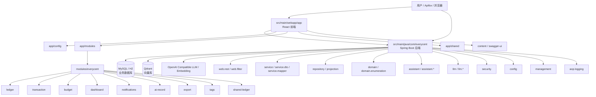
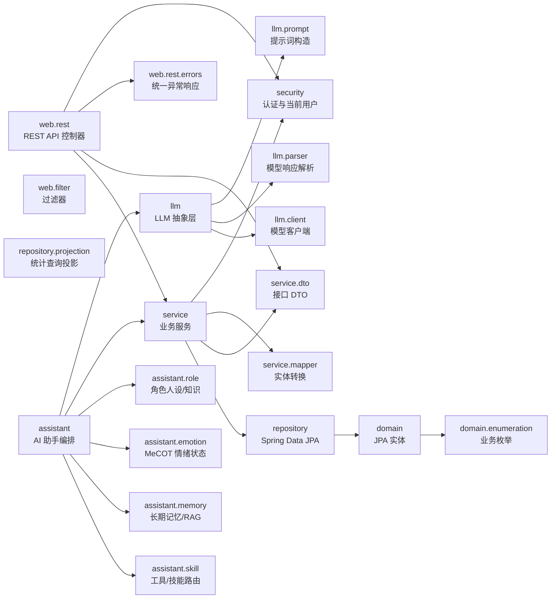
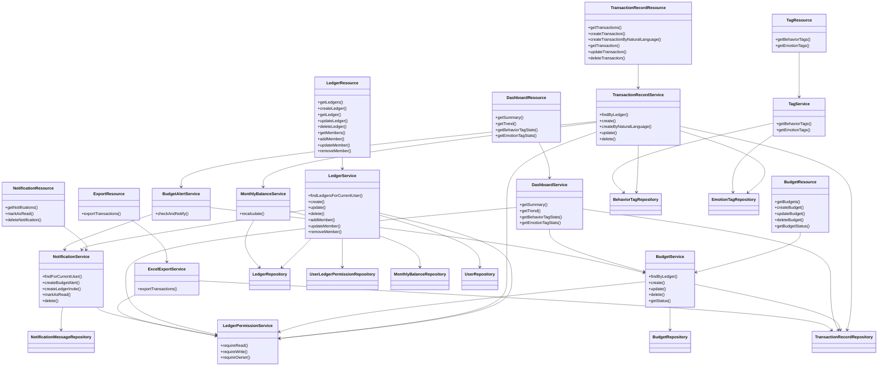
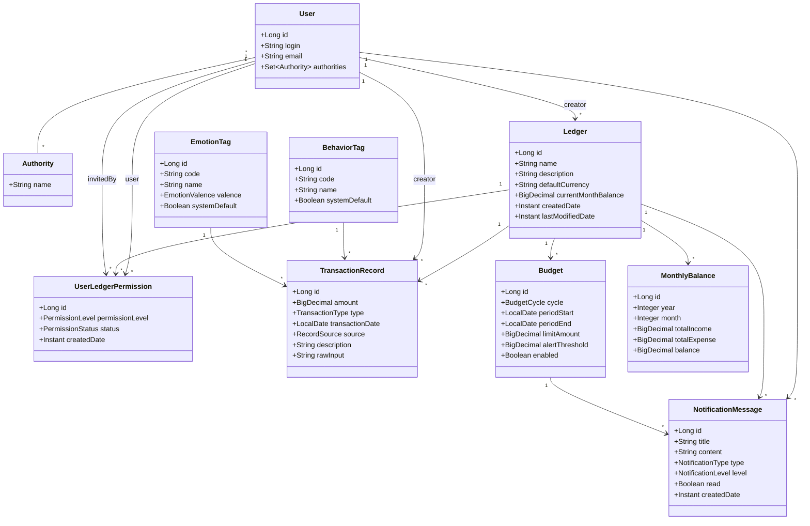
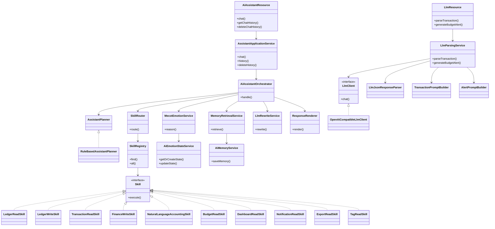
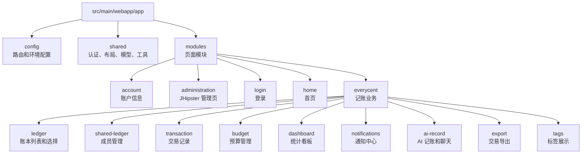
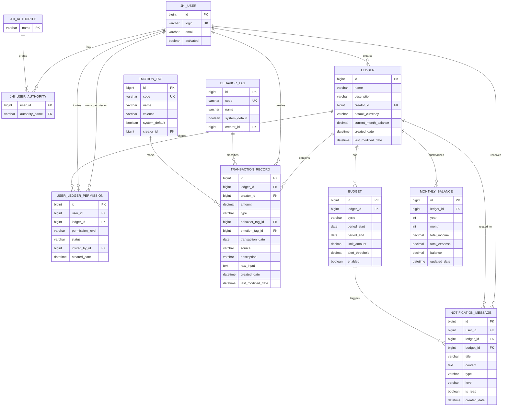
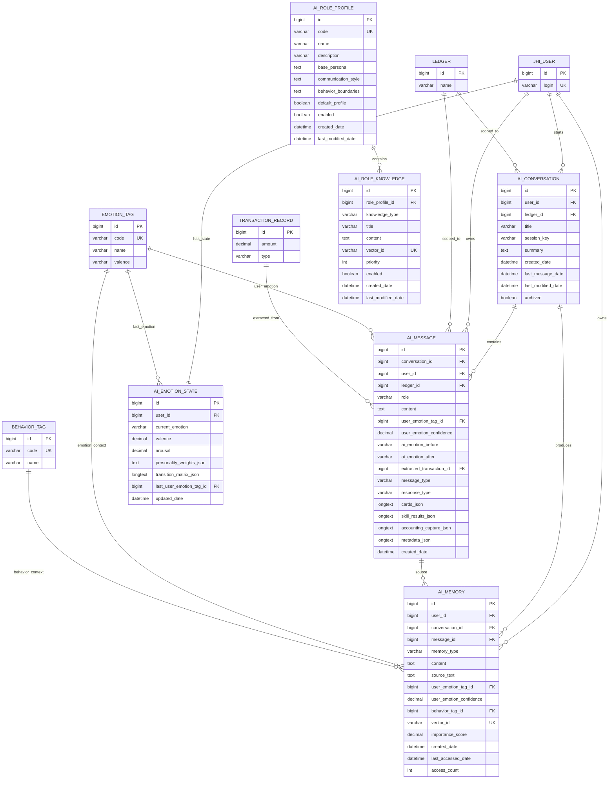

# EveryCent 项目中期检查文档

本文档根据当前项目代码和已完成开发内容整理，用于项目中期检查、系统介绍和答辩展示。文档包含项目规划、系统需求、总体设计、功能模块设计、数据库设计、包图、核心类图、AI/LLM 类图和 E-R 图。图表使用 Mermaid 语法，可在支持 Mermaid 的 Markdown 查看器、IDE 插件或 GitLab/GitHub 页面中渲染。

## 1. 项目范围

EveryCent 当前项目由前后端一体工程组成：

- 后端：Spring Boot / JHipster，主包路径为 `src/main/java/com/everycent`。
- 前端：React + TypeScript，主目录为 `src/main/webapp/app`。
- 数据库：JPA 实体与 Liquibase 建表脚本共同定义，脚本位于 `src/main/resources/config/liquibase/changelog`。
- 外部能力：LLM 兼容客户端、Embedding、Qdrant 向量库接口，用于自然语言记账、Assistant、MeCOT 情绪状态与长期记忆。

## 2. 系统规划

### 2.1 项目背景

EveryCent 面向个人和家庭日常记账场景，目标是提供一个可多人共享、可统计分析、可预算提醒，并支持 AI 辅助录入的智能记账系统。传统记账系统通常依赖手动填写金额、分类、日期和备注，使用门槛较高，长期坚持成本较大。本项目在常规账本、交易、预算和报表能力之上，引入自然语言解析、AI 聊天式记账、情绪标签和行为标签，使用户可以用更自然的方式完成财务记录与回顾。

### 2.2 建设目标

- 建立完整的账本管理能力，支持用户创建账本、修改账本、删除账本和查看账本详情。
- 支持共享账本场景，账本创建者可以邀请成员，并为成员分配只读或读写权限。
- 支持收入和支出交易记录，包含金额、日期、行为标签、情绪标签、来源和备注。
- 支持预算设置、预算状态查询和预算超额/接近阈值提醒。
- 支持仪表盘统计，包括周期收支汇总、趋势分析、行为标签统计和情绪标签统计。
- 支持通知中心，用于接收共享邀请、预算预警等系统消息。
- 支持交易数据 Excel 导出，满足用户备份、汇报和二次分析需求。
- 支持 LLM 自然语言记账和 AI Assistant 对话式交互，提高录入效率。
- 预留 MeCOT 情绪推理、长期记忆和角色知识能力，为后续智能财务助手扩展做准备。

### 2.3 用户角色规划

| 角色 | 说明 | 主要权限 |
| --- | --- | --- |
| 未登录用户 | 尚未通过 JWT 认证的访问者 | 只能访问登录、注册等公开接口 |
| 普通用户 | 完成登录后的系统用户 | 创建账本、查看自己有权限的账本、管理自己的交易和通知 |
| 账本所有者 | 账本创建者或拥有 OWNER 权限的成员 | 管理账本信息、删除账本、邀请成员、调整成员权限 |
| 共享成员 | 被邀请加入账本的用户 | 根据权限查看或编辑账本内交易、预算和统计数据 |
| 管理员 | JHipster 管理用户 | 管理系统用户、权限和后台管理接口 |

### 2.4 阶段规划

| 阶段 | 目标 | 当前状态 |
| --- | --- | --- |
| 第一阶段：基础工程搭建 | 建立 JHipster 前后端工程、认证授权、数据库迁移、开发环境 | 已完成 |
| 第二阶段：核心记账功能 | 实现账本、成员权限、交易、标签、月度余额 | 已完成 |
| 第三阶段：预算与统计 | 实现预算 CRUD、预算状态、仪表盘统计、预算提醒 | 已完成 |
| 第四阶段：通知与导出 | 实现通知中心、共享邀请通知、预算通知、Excel 导出 | 已完成 |
| 第五阶段：AI 能力接入 | 实现自然语言记账、LLM 解析、AI Assistant 聊天框架 | 已完成主要链路 |
| 第六阶段：体验完善和回归测试 | 补充异常用例、接口契约适配、权限边界、前端联调 | 进行中 |
| 第七阶段：智能助手增强 | 强化长期记忆、角色知识、情绪推理、复杂工具调用 | 后续完善 |

## 3. 系统需求分析

### 3.1 功能性需求

1. 账本管理：用户可以创建、查询、修改、删除账本，账本名称在同一用户范围内需要避免重复。
2. 成员管理：账本所有者可以添加成员、修改成员权限、移除成员，系统需要防止重复邀请。
3. 交易管理：用户可以按账本新增、查询、修改、删除交易，交易变更后自动刷新月度余额。
4. 标签管理：系统提供默认行为标签和情绪标签，用于交易分类和统计。
5. 预算管理：用户可以为账本设置周期预算，系统按账本、周期和日期范围保证预算唯一。
6. 预算预警：新增或修改交易后，系统检查预算使用率，并在达到阈值或超预算时生成通知。
7. 仪表盘统计：系统支持周期收支汇总、趋势数据、行为标签占比、情绪标签占比。
8. 通知中心：用户可以查询通知、标记已读和删除通知。
9. 数据导出：用户可以按日期范围导出账本交易 Excel 文件。
10. AI 记账：用户输入自然语言后，系统调用 LLM 解析金额、类型、日期、标签和描述，并生成交易。
11. AI 助手：系统提供对话式入口，支持聊天历史、技能路由、工具调用和结构化响应。

### 3.2 非功能性需求

- 安全性：接口基于 JWT 鉴权，账本相关操作必须经过账本权限校验。
- 一致性：交易、预算、月度余额和通知之间的联动需要由服务层统一维护。
- 可维护性：后端按 Resource、Service、Repository、Domain、DTO 分层，降低控制器和持久层耦合。
- 可扩展性：AI 能力通过 `llm` 和 `assistant.skill` 抽象，方便后续替换模型或增加新技能。
- 可测试性：核心服务使用单元测试和契约测试验证，重点覆盖权限、预算、通知、导出等链路。
- 可观测性：保留 JHipster Actuator、日志、安全指标等基础设施，便于开发调试和运行监控。

## 4. 总体设计

### 4.1 技术架构

系统采用前后端一体化工程结构：

- 前端使用 React + TypeScript，按业务页面拆分为账本、交易、预算、看板、通知、AI 记账等模块。
- 后端使用 Spring Boot / JHipster，提供 REST API、JWT 安全认证、JPA 持久化和 Liquibase 数据库迁移。
- 数据库使用 MySQL 作为主要运行环境，测试环境可使用 H2。
- AI 能力通过 OpenAI Compatible API 接入，Embedding 与向量检索通过 Qdrant 预留扩展能力。

### 4.2 后端分层设计

| 层次 | 包路径 | 设计说明 |
| --- | --- | --- |
| 接口层 | `com.everycent.web.rest` | 暴露 REST API，处理路径参数、请求体、响应状态码 |
| 应用服务层 | `com.everycent.service` | 承载业务规则、权限校验、事务处理和跨模块协作 |
| DTO 层 | `com.everycent.service.dto` | 定义接口输入输出结构，隔离实体和 API 契约 |
| 仓储层 | `com.everycent.repository` | 使用 Spring Data JPA 访问数据库 |
| 领域层 | `com.everycent.domain` | 定义 JPA 实体和实体之间的关系 |
| 枚举层 | `com.everycent.domain.enumeration` | 定义交易类型、预算周期、权限等级、通知类型等枚举 |
| 安全层 | `com.everycent.security` | 处理当前用户、JWT 认证和 Spring Security 集成 |
| AI 编排层 | `com.everycent.assistant` | 处理聊天、技能路由、记忆、情绪和角色知识 |
| LLM 适配层 | `com.everycent.llm` | 封装模型请求、提示词和响应解析 |

### 4.3 前端设计

前端业务集中在 `src/main/webapp/app/modules/everycent` 下，按页面和功能拆分：

- `ledger`：账本列表、账本选择和账本基础信息维护。
- `shared-ledger`：共享账本成员管理。
- `transaction`：交易列表、交易新增/编辑、标签选择。
- `budget`：预算设置和预算状态展示。
- `dashboard`：收支汇总、趋势图、行为标签和情绪标签统计。
- `notifications`：通知列表、已读操作和删除操作。
- `ai-record`：AI 聊天、自然语言记账、解析结果预览。
- `export`：交易数据导出。
- `tags`：行为标签和情绪标签展示。

### 4.4 权限设计

系统权限分为认证权限和账本业务权限两层：

- 认证权限由 Spring Security 和 JWT 处理，未登录用户不能访问需要认证的 API。
- 账本业务权限由 `LedgerPermissionService` 处理，读操作需要 READ 权限，写操作需要 READ_WRITE 或 OWNER 权限，成员管理和删除账本需要 OWNER 权限。
- 成员权限记录保存在 `user_ledger_permission` 表中，按 `user_id + ledger_id` 保证唯一，避免重复邀请。

### 4.5 数据一致性设计

- 新增、修改、删除交易后，`MonthlyBalanceService` 重新计算对应账本月份余额。
- 交易变更后，`BudgetAlertService` 检查预算使用率，并通过 `NotificationService` 生成预算提醒。
- 删除账本时，需要先处理账本下交易、预算、月度余额、成员权限、通知等关联数据，避免外键约束失败。
- 创建预算时，按账本、周期、开始日期和结束日期检查唯一性，避免同一周期重复预算。

## 5. 模块设计

### 5.1 账本与成员模块

账本模块由 `LedgerResource.java` 和 `LedgerService.java` 实现。核心职责包括账本 CRUD、当前用户账本列表、账本详情、共享成员查询、成员添加、成员权限更新和成员移除。成员权限实体为 `UserLedgerPermission.java`，权限枚举为 `PermissionLevel.java`。

### 5.2 交易模块

交易模块由 `TransactionRecordResource.java` 和 `TransactionRecordService.java` 实现。交易实体为 `TransactionRecord.java`，支持收入和支出两种类型，关联账本、创建人、行为标签和情绪标签。交易服务负责权限校验、分页查询、标签绑定、月度余额刷新和预算提醒触发。

### 5.3 预算模块

预算模块由 `BudgetResource.java` 和 `BudgetService.java` 实现。预算实体为 `Budget.java`，支持周期、预算金额、提醒阈值和启用状态。预算状态返回预算金额、已使用金额、剩余金额、使用率、是否超预算和提醒等级。

### 5.4 仪表盘模块

仪表盘模块由 `DashboardResource.java` 和 `DashboardService.java` 实现。系统根据周期参数计算收入总额、支出总额、余额、交易数量、预算使用率和标签分布，为前端看板提供统计数据。

### 5.5 通知模块

通知模块由 `NotificationResource.java` 和 `NotificationService.java` 实现。通知实体为 `NotificationMessage.java`，支持共享邀请通知、预算提醒通知、已读状态和分页查询。通知只允许当前接收用户查看和操作。

### 5.6 标签模块

标签模块由 `TagResource.java` 和 `TagService.java` 实现，行为标签实体为 `BehaviorTag.java`，情绪标签实体为 `EmotionTag.java`。系统默认标签通过 Liquibase 初始化，并支持后续扩展用户自定义标签。

### 5.7 导出模块

导出模块由 `ExportResource.java` 和 `ExcelExportService.java` 实现，使用 Apache POI 生成 Excel 文件。导出接口返回二进制文件流，适合浏览器下载，不按 JSON 契约返回。

### 5.8 AI 与 LLM 模块

LLM 解析模块由 `LlmResource.java`、`LlmParsingService.java`、`LlmClient.java`、`OpenAiCompatibleLlmClient.java`、提示词构造器和响应解析器组成。AI Assistant 模块由 `AiAssistantResource.java`、`AssistantApplicationService.java`、`AiAssistantOrchestrator.java`、`SkillRouter.java`、`SkillRegistry.java` 和多个 Skill 实现组成。

### 5.9 MeCOT、长期记忆和角色知识模块

AI 扩展模块包括 `assistant.emotion`、`assistant.memory` 和 `assistant.role`。其中情绪模块维护 AI 情绪状态，记忆模块负责长期记忆抽取和向量检索，角色模块负责 AI 人设和角色知识检索。这些模块为后续个性化智能财务助手提供基础。

## 6. 当前进度与后续计划

### 6.1 已完成内容

| 类别 | 已完成内容 |
| --- | --- |
| 基础工程 | Spring Boot / JHipster 工程、React 前端工程、JWT 认证、Liquibase 数据库迁移 |
| 账本业务 | 账本 CRUD、账本详情、账本名称重复校验、账本删除关联数据处理 |
| 成员共享 | 成员邀请、权限更新、成员移除、重复邀请校验、共享邀请通知 |
| 交易业务 | 交易 CRUD、分页查询、自然语言记账入口、行为标签和情绪标签绑定 |
| 预算业务 | 预算 CRUD、预算唯一性校验、预算状态查询、预算使用率计算 |
| 统计看板 | 收支汇总、趋势统计、行为标签统计、情绪标签统计 |
| 通知中心 | 通知分页查询、标记已读、删除通知、预算提醒通知 |
| 数据导出 | 按账本和日期范围导出 Excel |
| AI 能力 | LLM 解析、AI Assistant 聊天接口、技能路由、记忆和情绪模块基础结构 |
| 文档资料 | 后端实现说明、项目中期检查文档、类图、包图、E-R 图和图片导出 |

### 6.2 当前风险与待完善点

- 接口契约需要持续和 Apifox 定义保持一致，尤其是异常状态码、字段类型和导出类非 JSON 响应。
- AI Assistant 的长期记忆、角色知识和 MeCOT 情绪推理已有结构，但仍需要更多真实场景联调和效果验证。
- 前端页面已经按模块拆分，但仍需要继续完善交互体验、表单校验、空状态和异常提示。
- 权限边界需要继续回归测试，包括未登录、无账本权限、只读成员写操作、成员删除等异常路径。
- 预算通知和共享邀请通知需要继续覆盖多用户、多账本、多预算周期场景。

### 6.3 下一阶段计划

| 优先级 | 计划 | 说明 |
| --- | --- | --- |
| 高 | 完成接口回归测试 | 使用 Apifox 覆盖正常用例和异常用例，修正契约不一致问题 |
| 高 | 完善前端联调 | 确保账本、交易、预算、通知、导出、AI 记账页面均可完整走通 |
| 中 | 强化 AI Assistant | 增加更多技能调用场景，完善聊天历史、结构化卡片和自然语言多交易拆分 |
| 中 | 完善通知策略 | 优化预算提醒去重、阈值变化、通知接收人和已读状态 |
| 中 | 补充自动化测试 | 增加 Service 单元测试和 Resource 集成测试 |
| 低 | 优化展示文档 | 根据中期检查反馈继续调整类图、E-R 图和模块说明 |

## 7. 图片文件清单

本文档中的 Mermaid 图已经导出为图片文件：

| 图 | PNG | SVG | Mermaid 源文件 |
| --- | --- | --- | --- |
| 整体分层包图 | [01-project-package.png](diagrams/images/01-project-package.png) | [01-project-package.svg](diagrams/svg/01-project-package.svg) | [01-project-package.mmd](diagrams/source/01-project-package.mmd) |
| 后端包职责图 | [02-backend-package.png](diagrams/images/02-backend-package.png) | [02-backend-package.svg](diagrams/svg/02-backend-package.svg) | [02-backend-package.mmd](diagrams/source/02-backend-package.mmd) |
| 核心业务类图 | [03-business-class.png](diagrams/images/03-business-class.png) | [03-business-class.svg](diagrams/svg/03-business-class.svg) | [03-business-class.mmd](diagrams/source/03-business-class.mmd) |
| 核心实体类图 | [04-domain-class.png](diagrams/images/04-domain-class.png) | [04-domain-class.svg](diagrams/svg/04-domain-class.svg) | [04-domain-class.mmd](diagrams/source/04-domain-class.mmd) |
| AI / LLM 类图 | [05-ai-llm-class.png](diagrams/images/05-ai-llm-class.png) | [05-ai-llm-class.svg](diagrams/svg/05-ai-llm-class.svg) | [05-ai-llm-class.mmd](diagrams/source/05-ai-llm-class.mmd) |
| 前端模块图 | [06-frontend-package.png](diagrams/images/06-frontend-package.png) | [06-frontend-package.svg](diagrams/svg/06-frontend-package.svg) | [06-frontend-package.mmd](diagrams/source/06-frontend-package.mmd) |
| 核心业务 E-R 图 | [07-business-er.png](diagrams/images/07-business-er.png) | [07-business-er.svg](diagrams/svg/07-business-er.svg) | [07-business-er.mmd](diagrams/source/07-business-er.mmd) |
| AI / Assistant / RAG E-R 图 | [08-ai-er.png](diagrams/images/08-ai-er.png) | [08-ai-er.svg](diagrams/svg/08-ai-er.svg) | [08-ai-er.mmd](diagrams/source/08-ai-er.mmd) |

## 8. 项目包图

### 8.1 整体分层包图

### 8.2 后端包职责

### 8.3 主要包与文件

| 包/目录 | 主要文件 | 职责 |
| --- | --- | --- |
| `web.rest` | `LedgerResource.java`, `TransactionRecordResource.java`, `BudgetResource.java`, `DashboardResource.java`, `NotificationResource.java`, `TagResource.java`, `ExportResource.java`, `LlmResource.java`, `AiAssistantResource.java` | 对外 REST API |
| `service` | `LedgerService.java`, `TransactionRecordService.java`, `BudgetService.java`, `DashboardService.java`, `NotificationService.java`, `ExcelExportService.java`, `BudgetAlertService.java`, `LedgerPermissionService.java`, `LlmParsingService.java` | 核心业务规则、权限校验、统计、导出、AI 记账 |
| `service.dto` | `LedgerDTO.java`, `TransactionRecordDTO.java`, `BudgetDTO.java`, `DashboardSummaryDTO.java`, `NotificationMessageDTO.java`, `TransactionPageDTO.java` | API 入参与出参结构 |
| `repository` | `LedgerRepository.java`, `TransactionRecordRepository.java`, `BudgetRepository.java`, `NotificationMessageRepository.java`, `AiConversationRepository.java`, `AiMessageRepository.java` | 数据访问 |
| `domain` | `Ledger.java`, `TransactionRecord.java`, `Budget.java`, `NotificationMessage.java`, `AiConversation.java`, `AiMessage.java`, `AiMemory.java` | JPA 实体 |
| `assistant` | `AssistantApplicationService.java`, `AiAssistantOrchestrator.java`, `AiAssistantService.java`, `SimpleChatReplyService.java` | AI 助手应用服务与对话编排 |
| `assistant.skill` | `SkillRouter.java`, `SkillRegistry.java`, `LedgerReadSkill.java`, `FinanceWriteSkill.java`, `NaturalLanguageAccountingSkill.java` | Assistant 工具调用和业务技能 |
| `assistant.memory` | `AiMemoryService.java`, `MemoryRetrievalService.java`, `QdrantVectorStoreClient.java`, `OpenAiCompatibleEmbeddingClient.java` | 长期记忆、Embedding、向量检索 |
| `assistant.emotion` | `MecotEmotionService.java`, `AiEmotionStateService.java`, `MecotEmotionReasoningResponseParser.java` | MeCOT 情绪推理与状态维护 |
| `assistant.role` | `AiRoleProfileService.java`, `RoleKnowledgeRetrievalService.java`, `RolePromptAdapter.java` | AI 角色人设和角色知识 |
| `llm` | `LlmParsingService.java`, `LlmPromptService.java` | LLM 能力接口 |
| `llm.client` | `LlmClient.java`, `OpenAiCompatibleLlmClient.java` | 调用兼容 OpenAI 协议的模型服务 |
| `llm.dto` | `TransactionParseRequestDTO.java`, `TransactionParseResultDTO.java`, `AiAlertRequestDTO.java`, `AiAlertResultDTO.java` | LLM 请求与响应 DTO |
| `src/main/webapp/app/modules/everycent` | `ledger`, `transaction`, `budget`, `dashboard`, `notifications`, `ai-record`, `export`, `tags`, `shared-ledger` | EveryCent 前端业务页面 |

## 9. 核心业务类图

该类图展示记账业务主链路：REST 控制器接收请求，Service 处理权限和业务规则，Repository 访问实体。

## 10. 核心实体类图

## 11. AI / LLM 类图

## 12. 前端模块图

## 13. E-R 图

### 13.1 核心业务 E-R 图

### 13.2 AI / Assistant / RAG E-R 图

## 14. 主要 API 与控制器对应关系

| 功能 | API | 控制器文件 | 主要服务 |
| --- | --- | --- | --- |
| 账本管理 | `GET/POST /api/ledgers`, `GET/PUT/DELETE /api/ledgers/{ledgerId}` | `LedgerResource.java` | `LedgerService.java` |
| 成员共享 | `GET/POST /api/ledgers/{ledgerId}/members`, `PUT/DELETE /api/ledgers/{ledgerId}/members/{userId}` | `LedgerResource.java` | `LedgerService.java`, `NotificationService.java` |
| 交易记录 | `GET/POST /api/ledgers/{ledgerId}/transactions`, `GET/PUT/DELETE /api/transactions/{transactionId}` | `TransactionRecordResource.java` | `TransactionRecordService.java` |
| 自然语言记账 | `POST /api/ledgers/{ledgerId}/transactions/natural-language` | `TransactionRecordResource.java` | `TransactionRecordService.java`, `LlmParsingService.java` |
| 预算管理 | `GET/POST /api/ledgers/{ledgerId}/budgets`, `PUT/DELETE /api/budgets/{budgetId}`, `GET /api/ledgers/{ledgerId}/budgets/status` | `BudgetResource.java` | `BudgetService.java`, `BudgetAlertService.java` |
| 统计看板 | `GET /api/ledgers/{ledgerId}/dashboard/summary`, `trend`, `behavior-tags`, `emotion-tags` | `DashboardResource.java` | `DashboardService.java` |
| 标签 | `GET /api/tags/behavior`, `GET /api/tags/emotion` | `TagResource.java` | `TagService.java` |
| 通知 | `GET /api/notifications`, `PATCH /api/notifications/{notificationId}/read`, `DELETE /api/notifications/{notificationId}` | `NotificationResource.java` | `NotificationService.java` |
| Excel 导出 | `GET /api/ledgers/{ledgerId}/transactions/export` | `ExportResource.java` | `ExcelExportService.java` |
| LLM 解析 | `POST /api/ai/transaction/parse`, `POST /api/ai/budget-alert/generate` | `LlmResource.java` | `LlmParsingService.java` |
| AI 助手 | `POST /api/assistant/chat`, `GET/DELETE /api/assistant/chat/history` | `AiAssistantResource.java` | `AssistantApplicationService.java` |

## 15. 图表说明与边界

- 包图按当前目录结构整理，既包含后端 Java 包，也包含前端 React 模块目录。
- 类图聚焦系统介绍时最需要讲清楚的主干类，没有列出所有 getter、setter、构造器和测试类。
- E-R 图以 Liquibase 建表脚本和当前 JPA 实体为准，包含 JHipster 用户权限表、EveryCent 业务表、AI Assistant / RAG / MeCOT 表。
- `AI_MEMORY.vector_id` 和 `AI_ROLE_KNOWLEDGE.vector_id` 对应向量库中的向量标识，关系型数据库只保存引用，不直接保存向量内容。
- 预算、月度余额、通知等表存在唯一约束或索引，例如预算按 `ledger_id + cycle + period_start + period_end` 唯一，成员权限按 `user_id + ledger_id` 唯一。
