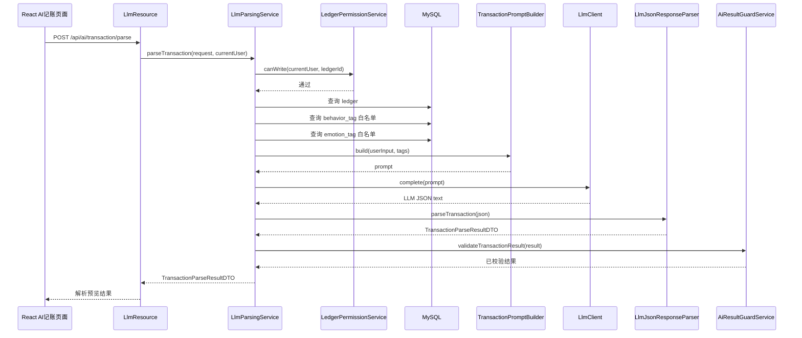
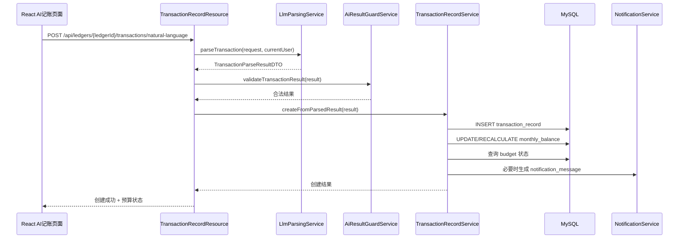
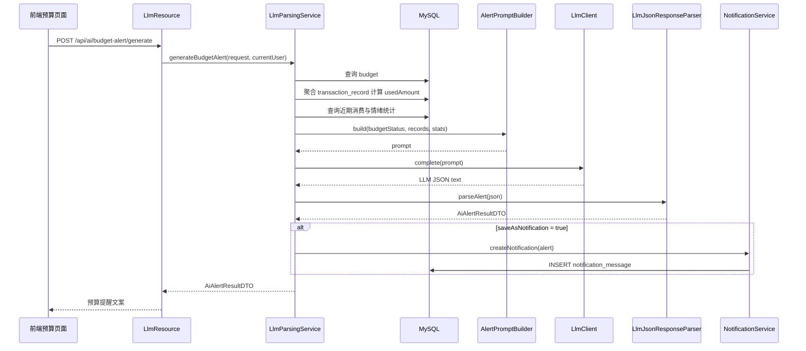

# EveryCent LLM 后端模块详细设计文档

> 建议保存路径：`docs/llm-backend-design.md`  
> 适用项目：EveryCent 智能记账系统  
> 技术基座：JHipster Monolithic Application + Spring Boot + React + MySQL + JWT  
> 设计目的：补充系统详细设计文档中 LLM 后端部分的具体类职责、接口定义、数据库依赖、数据流、校验规则与风险控制。

---

## 1. 设计边界说明

EveryCent 系统的 LLM 模块属于后端业务层中的智能辅助子模块。它不直接替代数据库、权限系统和收支记录业务逻辑，而是作为自然语言解析和个性化提醒生成的辅助能力。

LLM 模块的核心边界如下：

1. LLM 只负责把用户自然语言输入解析为结构化候选结果。
2. LLM 不直接写入数据库。
3. LLM 返回结果必须经过后端校验。
4. 用户确认后，最终仍由 `TransactionRecordService` 写入 `transaction_record` 表。
5. 预算提醒文本可以由 LLM 生成，但预算是否超支必须由数据库查询和后端计算决定。
6. LLM API Key 不允许写入代码或提交到 GitHub。
7. LLM 调用失败时，系统必须降级为传统表单记账或普通预算提醒。

与原系统结构的对应关系：

```text
前端 ai-record 页面
    ↓
LlmResource / TransactionRecordResource
    ↓
LlmParsingService
    ↓
PromptBuilder + LlmClient + JsonResponseParser + AiResultGuardService
    ↓
返回结构化 DTO
    ↓
用户确认
    ↓
TransactionRecordService 写入数据库
```

---

## 2. LLM 模块总体功能

LLM 后端模块主要实现两类能力：

| 功能 | 输入 | 输出 | 是否直接入库 | 说明 |
|---|---|---|---|---|
| 自然语言记账解析 | 用户自然语言文本、账本 ID、日期 | `TransactionParseResultDTO` | 否 | 用于前端预览，用户确认后再入库 |
| 自然语言解析并创建记录 | 用户自然语言文本、账本 ID、确认标记 | `TransactionRecordDTO` 或创建结果 | 是，但由 `TransactionRecordService` 入库 | LLM 只解析，Service 校验后创建记录 |
| 预算提醒文案生成 | 预算状态、近期支出、情绪标签统计 | `AiAlertResultDTO` | 可选写入 `notification_message` | 预算是否超支不由 LLM 判断 |
| AI 结果风险校验 | LLM 解析结果 | 合法 DTO 或错误信息 | 否 | 防止金额、标签、类型、日期异常 |

---

## 3. 包结构设计

建议在 JHipster 原有结构中补充以下包：

```text
src/main/java/com/everycent/
├── web/rest/
│   └── LlmResource.java
├── service/
│   ├── LlmParsingService.java
│   ├── AiResultGuardService.java
│   └── dto/
│       ├── TransactionParseRequestDTO.java
│       ├── TransactionParseResultDTO.java
│       ├── AiAlertRequestDTO.java
│       └── AiAlertResultDTO.java
└── llm/
    ├── client/
    │   ├── LlmClient.java
    │   ├── OpenAiCompatibleLlmClient.java
    │   └── LlmClientException.java
    ├── prompt/
    │   ├── TransactionPromptBuilder.java
    │   └── AlertPromptBuilder.java
    ├── parser/
    │   └── LlmJsonResponseParser.java
    └── config/
        └── LlmProperties.java
```

说明：

1. `web.rest` 负责对外 REST API。
2. `service` 负责业务编排和校验。
3. `service.dto` 负责前后端交互 DTO。
4. `llm.client` 负责实际调用云端 LLM。
5. `llm.prompt` 负责构造提示词。
6. `llm.parser` 负责解析模型返回 JSON。
7. `llm.config` 负责读取 LLM 配置。

---

## 4. LLM 模块类图

```mermaid
classDiagram
    class LlmResource {
        +parseTransaction(request) ResponseEntity~TransactionParseResultDTO~
        +generateBudgetAlert(request) ResponseEntity~AiAlertResultDTO~
    }

    class LlmParsingService {
        +parseTransaction(request, currentUser) TransactionParseResultDTO
        +generateBudgetAlert(request, currentUser) AiAlertResultDTO
    }

    class LlmClient {
        <<interface>>
        +complete(prompt) String
    }

    class OpenAiCompatibleLlmClient {
        -String baseUrl
        -String apiKey
        -String model
        -Duration timeout
        +complete(prompt) String
    }

    class TransactionPromptBuilder {
        +build(userInput, ledger, behaviorTags, emotionTags, defaultDate) String
    }

    class AlertPromptBuilder {
        +build(ledger, budgetStatus, recentRecords, emotionStats) String
    }

    class LlmJsonResponseParser {
        +parseTransaction(json) TransactionParseResultDTO
        +parseAlert(json) AiAlertResultDTO
    }

    class AiResultGuardService {
        +validateTransactionResult(result, ledgerId, currentUser) TransactionParseResultDTO
        +validateAmount(amount)
        +validateType(type)
        +validateBehaviorTag(code)
        +validateEmotionTag(code)
        +validateTransactionDate(date)
        +sanitizeText(text)
    }

    class LedgerPermissionService {
        +canRead(user, ledgerId)
        +canWrite(user, ledgerId)
    }

    class BehaviorTagRepository
    class EmotionTagRepository
    class TransactionRecordRepository
    class BudgetRepository
    class NotificationService

    LlmResource --> LlmParsingService
    LlmParsingService --> LedgerPermissionService
    LlmParsingService --> LlmClient
    LlmParsingService --> TransactionPromptBuilder
    LlmParsingService --> AlertPromptBuilder
    LlmParsingService --> LlmJsonResponseParser
    LlmParsingService --> AiResultGuardService
    LlmParsingService --> BehaviorTagRepository
    LlmParsingService --> EmotionTagRepository
    LlmParsingService --> TransactionRecordRepository
    LlmParsingService --> BudgetRepository
    LlmParsingService --> NotificationService
    LlmClient <|.. OpenAiCompatibleLlmClient
```



---

## 5. 每个类的详细职责

### 5.1 LlmResource

所在包：

```text
com.everycent.web.rest
```

职责：

1. 对前端暴露 LLM 相关 REST API。
2. 接收自然语言记账解析请求。
3. 接收预算提醒生成请求。
4. 获取当前登录用户。
5. 调用 `LlmParsingService`。
6. 返回结构化 DTO 给前端。

该类不应直接调用数据库 Repository，也不应直接调用 LLM API。

建议方法：

```java
@RestController
@RequestMapping("/api/ai")
public class LlmResource {

    @PostMapping("/transaction/parse")
    public ResponseEntity<TransactionParseResultDTO> parseTransaction(
        @Valid @RequestBody TransactionParseRequestDTO request
    );

    @PostMapping("/budget-alert/generate")
    public ResponseEntity<AiAlertResultDTO> generateBudgetAlert(
        @Valid @RequestBody AiAlertRequestDTO request
    );
}
```

接口说明：

| 方法 | 路径 | 功能 | 是否入库 |
|---|---|---|---|
| POST | `/api/ai/transaction/parse` | 自然语言记账解析预览 | 否 |
| POST | `/api/ai/budget-alert/generate` | 预算提醒文案生成 | 可选，由 Service 决定 |

---

### 5.2 LlmParsingService

所在包：

```text
com.everycent.service
```

职责：

1. 编排 LLM 解析完整流程。
2. 校验当前用户是否有账本访问权限。
3. 从数据库读取行为标签和情绪标签白名单。
4. 构造 Prompt。
5. 调用 `LlmClient`。
6. 解析 LLM 返回内容。
7. 调用 `AiResultGuardService` 做合法性校验。
8. 返回可供前端预览的结构化结果。
9. 生成预算提醒时读取近期交易、预算状态和情绪统计。

建议方法：

```java
@Service
@Transactional(readOnly = true)
public class LlmParsingService {

    public TransactionParseResultDTO parseTransaction(
        TransactionParseRequestDTO request,
        User currentUser
    );

    public AiAlertResultDTO generateBudgetAlert(
        AiAlertRequestDTO request,
        User currentUser
    );
}
```

`parseTransaction` 流程：

```text
1. 校验 request.ledgerId 非空。
2. 调用 LedgerPermissionService.canWrite(currentUser, ledgerId)。
3. 查询 ledger 基本信息。
4. 查询 behavior_tag 表，获取合法行为标签白名单。
5. 查询 emotion_tag 表，获取合法情绪标签白名单。
6. 调用 TransactionPromptBuilder.build(...) 构造提示词。
7. 调用 LlmClient.complete(prompt)。
8. 调用 LlmJsonResponseParser.parseTransaction(json)。
9. 调用 AiResultGuardService.validateTransactionResult(...)。
10. 返回 TransactionParseResultDTO。
```

`generateBudgetAlert` 流程：

```text
1. 校验当前用户对账本至少有 READ 权限。
2. 查询预算表 budget。
3. 查询 transaction_record 获取当前周期内支出金额。
4. 查询近期 transaction_record 获取近期消费记录。
5. 查询 emotion_tag / behavior_tag 关联统计。
6. 后端计算 usedAmount、remainingAmount、usedRatio、overBudget。
7. 将计算结果传给 AlertPromptBuilder。
8. 调用 LlmClient 生成个性化提醒文案。
9. 解析并校验提醒文案。
10. 返回 AiAlertResultDTO。
```

注意：

```text
预算是否超支必须由数据库查询和后端计算决定，不能由 LLM 自行判断。
```

---

### 5.3 LlmClient

所在包：

```text
com.everycent.llm.client
```

职责：

1. 定义统一 LLM 调用接口。
2. 隐藏具体云端模型供应商差异。
3. 让业务层只依赖接口，不依赖具体实现。

建议接口：

```java
public interface LlmClient {
    String complete(String prompt);
}
```

设计说明：

1. `prompt` 是已经构造好的完整提示词。
2. 返回值是模型原始字符串，通常要求模型返回 JSON 字符串。
3. 如果调用失败，应抛出 `LlmClientException`。
4. 后续可以扩展不同实现，例如本地模型、OpenAI-compatible API、学校代理 API。

---

### 5.4 OpenAiCompatibleLlmClient

所在包：

```text
com.everycent.llm.client
```

职责：

1. 实现 `LlmClient`。
2. 从配置读取 `baseUrl`、`apiKey`、`model`、`timeout`。
3. 向云端 LLM API 发起 HTTP 请求。
4. 获取模型输出文本。
5. 处理超时、认证失败、限流、网络异常。

建议字段：

```java
private final String baseUrl;
private final String apiKey;
private final String model;
private final Duration timeout;
private final RestTemplate restTemplate;
```

建议方法：

```java
@Override
public String complete(String prompt) {
    // 1. 构造请求体
    // 2. 设置 Authorization Header
    // 3. 调用 LLM API
    // 4. 提取模型输出文本
    // 5. 异常时抛出 LlmClientException
}
```

异常处理：

| 异常 | 处理方式 |
|---|---|
| API Key 缺失 | 返回服务不可用，提示使用手动记账 |
| 网络超时 | 返回降级提示 |
| 模型返回空内容 | 解析失败，要求用户手动填写 |
| HTTP 401/403 | 记录日志，不暴露密钥 |
| HTTP 429 | 提示稍后重试 |
| HTTP 5xx | 降级为手动流程 |

安全要求：

1. 不在日志中输出 API Key。
2. 不把用户密码、JWT、数据库密码放入 Prompt。
3. 不把完整用户账本历史全部发送给 LLM。
4. 只发送完成任务所需的最小信息。

---

### 5.5 TransactionPromptBuilder

所在包：

```text
com.everycent.llm.prompt
```

职责：

1. 构造自然语言记账解析 Prompt。
2. 将数据库中的行为标签和情绪标签作为白名单传入。
3. 要求 LLM 只返回 JSON。
4. 限制输出字段，避免模型返回无关内容。

建议方法：

```java
public String build(
    String userInput,
    Ledger ledger,
    List<BehaviorTag> behaviorTags,
    List<EmotionTag> emotionTags,
    LocalDate defaultDate
);
```

Prompt 输入数据来源：

| 输入 | 来源 |
|---|---|
| `userInput` | 前端自然语言输入 |
| `ledger.name` | `ledger` 表 |
| `behaviorTags` | `behavior_tag` 表 |
| `emotionTags` | `emotion_tag` 表 |
| `defaultDate` | 前端传入或当前日期 |

Prompt 输出 JSON 约束：

```json
{
  "amount": "50.00",
  "type": "EXPENSE",
  "behaviorTagCode": "FOOD",
  "emotionTagCode": "HAPPY",
  "transactionDate": "2026-06-15",
  "description": "中午吃饭",
  "confidence": 0.92
}
```

Prompt 规则：

1. `type` 只能为 `INCOME` 或 `EXPENSE`。
2. `behaviorTagCode` 必须来自 `behavior_tag.code`。
3. `emotionTagCode` 必须来自 `emotion_tag.code`。
4. `amount` 必须为正数。
5. 如果无法确定日期，使用默认日期。
6. 如果无法确定标签，使用 `OTHER` 或系统设计中的默认标签。
7. 不允许输出解释性文本。
8. 不允许输出 Markdown。

---

### 5.6 AlertPromptBuilder

所在包：

```text
com.everycent.llm.prompt
```

职责：

1. 构造预算提醒文案生成 Prompt。
2. 接收后端已经计算好的预算状态。
3. 接收近期消费摘要和情绪统计。
4. 生成个性化但不夸张、不刺激用户的提醒文案。

建议方法：

```java
public String build(
    Ledger ledger,
    BudgetStatusDTO budgetStatus,
    List<TransactionRecord> recentRecords,
    List<EmotionStatDTO> emotionStats
);
```

Prompt 输入数据来源：

| 输入 | 来源 |
|---|---|
| 账本名称 | `ledger` 表 |
| 预算金额 | `budget` 表 |
| 已使用金额 | `transaction_record` 聚合查询 |
| 剩余金额 | 后端计算 |
| 使用比例 | 后端计算 |
| 近期消费 | `transaction_record` 表 |
| 情绪统计 | `transaction_record` + `emotion_tag` 聚合查询 |

输出 JSON 约束：

```json
{
  "title": "本月预算即将超支",
  "content": "你本月餐饮和娱乐消费较集中，预算已使用 82%。建议接下来几天减少非必要支出。",
  "level": "WARNING",
  "needNotification": true
}
```

规则：

1. `level` 只能为 `INFO`、`WARNING`、`DANGER`。
2. 文案不得包含羞辱、责备、极端化表达。
3. 文案必须基于后端传入的预算状态，不允许编造金额。
4. 文案不直接决定是否入库。
5. 是否生成通知由后端根据 `needNotification` 和预算状态决定。

---

### 5.7 LlmJsonResponseParser

所在包：

```text
com.everycent.llm.parser
```

职责：

1. 将 LLM 返回的字符串解析为 DTO。
2. 处理模型返回中可能出现的多余文本。
3. 校验 JSON 基本结构。
4. 对字段做初步类型转换。
5. 在解析失败时抛出明确异常。

建议方法：

```java
public TransactionParseResultDTO parseTransaction(String jsonText);

public AiAlertResultDTO parseAlert(String jsonText);
```

解析策略：

```text
1. 去除首尾空白。
2. 如果模型错误返回 Markdown 代码块，则提取代码块内 JSON。
3. 使用 Jackson ObjectMapper 解析 JSON。
4. 检查必填字段是否存在。
5. 将 amount 转为 BigDecimal。
6. 将 transactionDate 转为 LocalDate。
7. 将 confidence 转为 Double。
8. 如果解析失败，抛出 LlmParseException。
```

不在 Parser 中做业务校验，业务校验交给 `AiResultGuardService`。

---

### 5.8 AiResultGuardService

所在包：

```text
com.everycent.service
```

职责：

1. 对 LLM 解析结果进行后端强校验。
2. 防止 LLM 幻觉导致非法数据入库。
3. 校验金额、类型、标签、日期、描述长度。
4. 将 LLM 返回的 tag code 映射为数据库中的 tag id。
5. 对低置信度结果设置 `needUserConfirm = true`。

建议方法：

```java
public TransactionParseResultDTO validateTransactionResult(
    TransactionParseResultDTO result,
    Long ledgerId,
    User currentUser
);

public void validateAmount(BigDecimal amount);

public void validateType(TransactionType type);

public BehaviorTag validateBehaviorTag(String behaviorTagCode);

public EmotionTag validateEmotionTag(String emotionTagCode);

public void validateTransactionDate(LocalDate transactionDate);

public String sanitizeText(String text);
```

校验规则：

| 字段 | 校验规则 |
|---|---|
| amount | 必须存在，且大于 0 |
| type | 必须为 `INCOME` 或 `EXPENSE` |
| behaviorTagCode | 必须存在于 `behavior_tag.code` |
| emotionTagCode | 必须存在于 `emotion_tag.code` |
| transactionDate | 不得为空，不得明显超出合理范围 |
| description | 长度不得超过数据库字段限制 |
| confidence | 小于阈值时要求用户确认 |
| rawInput | 需要截断并清洗，避免超长文本 |

重要原则：

```text
只要 AI 返回结果无法通过后端校验，就不能进入 transaction_record 表。
```

---

### 5.9 LlmProperties

所在包：

```text
com.everycent.llm.config
```

职责：

1. 读取 LLM 配置。
2. 避免把 API Key 写死在代码中。
3. 统一管理模型名、超时时间、置信度阈值等参数。

建议配置：

```yaml
app:
  llm:
    enabled: true
    provider: openai-compatible
    base-url: ${LLM_BASE_URL:}
    api-key: ${LLM_API_KEY:}
    model: ${LLM_MODEL:gpt-compatible-model}
    timeout-seconds: 20
    min-confidence: 0.70
    max-input-length: 500
```

建议类结构：

```java
@ConfigurationProperties(prefix = "app.llm")
public class LlmProperties {
    private Boolean enabled;
    private String provider;
    private String baseUrl;
    private String apiKey;
    private String model;
    private Integer timeoutSeconds;
    private Double minConfidence;
    private Integer maxInputLength;
}
```

安全要求：

1. `LLM_API_KEY` 通过环境变量注入。
2. `.env` 不提交 GitHub。
3. `.env.example` 只保留示例字段。
4. 日志中屏蔽密钥。

---

## 6. DTO 设计

### 6.1 TransactionParseRequestDTO

用途：前端发起自然语言解析请求。

```java
public class TransactionParseRequestDTO {
    @NotNull
    private Long ledgerId;

    @NotBlank
    @Size(max = 500)
    private String text;

    private LocalDate transactionDate;
}
```

字段说明：

| 字段 | 类型 | 来源 | 说明 |
|---|---|---|---|
| ledgerId | Long | 前端 | 当前账本 ID |
| text | String | 前端 | 用户输入的自然语言文本 |
| transactionDate | LocalDate | 前端可选 | 前端指定默认日期，不传则后端使用当前日期 |

---

### 6.2 TransactionParseResultDTO

用途：LLM 解析结果，返回前端预览。

```java
public class TransactionParseResultDTO {
    private BigDecimal amount;
    private TransactionType type;
    private String behaviorTagCode;
    private String behaviorTagName;
    private Long behaviorTagId;
    private String emotionTagCode;
    private String emotionTagName;
    private Long emotionTagId;
    private LocalDate transactionDate;
    private String description;
    private Double confidence;
    private Boolean needUserConfirm;
    private String rawInput;
}
```

字段与数据库映射：

| DTO 字段 | 数据库来源或目标 | 说明 |
|---|---|---|
| amount | `transaction_record.amount` | 用户确认后写入 |
| type | `transaction_record.type` | INCOME / EXPENSE |
| behaviorTagCode | `behavior_tag.code` | LLM 返回，后端校验 |
| behaviorTagName | `behavior_tag.name` | 前端显示 |
| behaviorTagId | `transaction_record.behavior_tag_id` | 用户确认后写入 |
| emotionTagCode | `emotion_tag.code` | LLM 返回，后端校验 |
| emotionTagName | `emotion_tag.name` | 前端显示 |
| emotionTagId | `transaction_record.emotion_tag_id` | 用户确认后写入 |
| transactionDate | `transaction_record.transaction_date` | 用户确认后写入 |
| description | `transaction_record.description` | 用户确认后写入 |
| rawInput | `transaction_record.raw_input` | 自然语言来源记录 |
| confidence | 不直接入库，可选 | 用于前端提示是否需要确认 |
| needUserConfirm | 不入库 | 控制前端确认流程 |

---

### 6.3 AiAlertRequestDTO

用途：请求生成个性化预算提醒。

```java
public class AiAlertRequestDTO {
    @NotNull
    private Long ledgerId;

    @NotNull
    private Long budgetId;

    private Boolean saveAsNotification;
}
```

字段说明：

| 字段 | 来源 | 说明 |
|---|---|---|
| ledgerId | 前端 | 当前账本 |
| budgetId | 前端 | 当前预算 |
| saveAsNotification | 前端 | 是否生成通知记录 |

---

### 6.4 AiAlertResultDTO

用途：返回预算提醒文案。

```java
public class AiAlertResultDTO {
    private String title;
    private String content;
    private AlertLevel level;
    private Boolean overBudget;
    private BigDecimal usedAmount;
    private BigDecimal limitAmount;
    private BigDecimal usedRatio;
    private Boolean needNotification;
    private Long notificationId;
}
```

字段与数据库映射：

| DTO 字段 | 数据来源或目标 | 说明 |
|---|---|---|
| title | LLM 生成，可写入 `notification_message.title` | 提醒标题 |
| content | LLM 生成，可写入 `notification_message.content` | 提醒正文 |
| level | 后端计算 + LLM 文案辅助 | INFO / WARNING / DANGER |
| overBudget | 后端根据 budget + transaction_record 计算 | 是否超预算 |
| usedAmount | `transaction_record` 聚合 | 已使用金额 |
| limitAmount | `budget.limit_amount` | 预算金额 |
| usedRatio | 后端计算 | 使用比例 |
| needNotification | 后端规则决定 | 是否需要落库通知 |
| notificationId | `notification_message.id` | 如果生成通知则返回 |

---

## 7. REST API 设计

### 7.1 自然语言解析预览接口

```text
POST /api/ai/transaction/parse
```

权限：

```text
当前用户对 ledgerId 具备 OWNER 或 READ_WRITE 权限。
```

请求：

```json
{
  "ledgerId": 1,
  "text": "今天中午吃饭花了50块钱，感觉很开心",
  "transactionDate": "2026-06-15"
}
```

响应：

```json
{
  "amount": "50.00",
  "type": "EXPENSE",
  "behaviorTagCode": "FOOD",
  "behaviorTagName": "餐饮",
  "behaviorTagId": 1,
  "emotionTagCode": "HAPPY",
  "emotionTagName": "开心",
  "emotionTagId": 3,
  "transactionDate": "2026-06-15",
  "description": "中午吃饭",
  "confidence": 0.92,
  "needUserConfirm": true,
  "rawInput": "今天中午吃饭花了50块钱，感觉很开心"
}
```

错误响应示例：

```json
{
  "type": "https://everycent/problem/llm-parse-failed",
  "title": "AI 解析失败",
  "status": 400,
  "detail": "无法从输入文本中识别有效金额，请使用手动记账。"
}
```

---

### 7.2 自然语言解析并创建收支记录接口

该接口属于收支记录模块，但会调用 LLM 模块。

```text
POST /api/ledgers/{ledgerId}/transactions/natural-language
```

权限：

```text
OWNER 或 READ_WRITE
```

请求：

```json
{
  "text": "今天中午吃饭花了50块钱，感觉很开心",
  "transactionDate": "2026-06-15",
  "confirm": true
}
```

后端流程：

```text
1. TransactionRecordResource 接收请求。
2. 校验用户写权限。
3. 调用 LlmParsingService.parseTransaction。
4. 得到 TransactionParseResultDTO。
5. 再次调用 AiResultGuardService 校验。
6. 构造 TransactionRecord。
7. 写入 transaction_record。
8. 更新 monthly_balance 或调用余额重算逻辑。
9. 检查 budget 是否触发告警。
10. 返回创建结果。
```

响应：

```json
{
  "transactionId": 101,
  "amount": "50.00",
  "type": "EXPENSE",
  "behaviorTagName": "餐饮",
  "emotionTagName": "开心",
  "budgetWarning": {
    "overBudget": false,
    "usedRatio": 0.63,
    "message": "本月预算使用正常"
  }
}
```

---

### 7.3 预算提醒文案生成接口

```text
POST /api/ai/budget-alert/generate
```

权限：

```text
当前用户对账本至少具备 READ_ONLY 权限。
```

请求：

```json
{
  "ledgerId": 1,
  "budgetId": 8,
  "saveAsNotification": true
}
```

响应：

```json
{
  "title": "本月预算即将超支",
  "content": "你本月餐饮和娱乐消费较集中，预算已使用 82%。建议接下来几天减少非必要支出。",
  "level": "WARNING",
  "overBudget": false,
  "usedAmount": "2460.00",
  "limitAmount": "3000.00",
  "usedRatio": 0.82,
  "needNotification": true,
  "notificationId": 15
}
```

---

## 8. 数据库使用说明

### 8.1 LLM 模块直接读取的表

| 表名 | 使用场景 | 读取字段 |
|---|---|---|
| `ledger` | 校验账本、构造 Prompt、生成提醒 | `id`, `name`, `description`, `default_currency`, `current_month_balance` |
| `user_ledger_permission` | 判断当前用户是否有读写权限 | `user_id`, `ledger_id`, `permission_level`, `status` |
| `behavior_tag` | 提供行为标签白名单 | `id`, `code`, `name`, `system_default`, `creator_id` |
| `emotion_tag` | 提供情绪标签白名单 | `id`, `code`, `name`, `valence`, `system_default`, `creator_id` |
| `transaction_record` | 预算提醒、近期消费摘要、情绪统计 | `amount`, `type`, `behavior_tag_id`, `emotion_tag_id`, `transaction_date`, `description`, `raw_input` |
| `budget` | 预算提醒计算 | `id`, `ledger_id`, `cycle`, `period_start`, `period_end`, `limit_amount`, `alert_threshold`, `enabled` |
| `monthly_balance` | 余额和预算提示上下文 | `ledger_id`, `year`, `month`, `total_income`, `total_expense`, `balance` |
| `jhi_user` | 当前用户和创建者信息 | `id`, `login`, `email` |

---

### 8.2 LLM 模块间接写入的表

LLM 模块原则上不直接写入业务表。以下写入应通过业务 Service 完成：

| 表名 | 写入时机 | 负责 Service | 说明 |
|---|---|---|---|
| `transaction_record` | 用户确认 AI 解析结果后 | `TransactionRecordService` | 写入金额、类型、标签、日期、描述、raw_input |
| `monthly_balance` | 收支记录创建、修改、删除后 | `TransactionRecordService` 或触发器 | 更新月收入、月支出、余额 |
| `notification_message` | 预算提醒需要保存时 | `NotificationService` | 保存 AI 生成的提醒标题和内容 |

---

### 8.3 自然语言记账入库映射

用户输入：

```text
今天中午吃饭花了50块钱，感觉很开心
```

LLM 解析结果：

```json
{
  "amount": "50.00",
  "type": "EXPENSE",
  "behaviorTagCode": "FOOD",
  "emotionTagCode": "HAPPY",
  "transactionDate": "2026-06-15",
  "description": "中午吃饭",
  "confidence": 0.92
}
```

数据库映射：

| LLM 字段 | 数据库字段 | 说明 |
|---|---|---|
| amount | `transaction_record.amount` | 金额 |
| type | `transaction_record.type` | 收入/支出 |
| behaviorTagCode | 先查 `behavior_tag.code`，得到 `behavior_tag.id` | 写入 `behavior_tag_id` |
| emotionTagCode | 先查 `emotion_tag.code`，得到 `emotion_tag.id` | 写入 `emotion_tag_id` |
| transactionDate | `transaction_record.transaction_date` | 交易日期 |
| description | `transaction_record.description` | 描述 |
| 原始文本 | `transaction_record.raw_input` | 保存自然语言输入 |
| 固定来源 | `transaction_record.source = NATURAL_LANGUAGE` | 表示 AI 解析来源 |
| 当前用户 | `transaction_record.creator_id` | 来自登录态 |
| 当前账本 | `transaction_record.ledger_id` | 来自 URL 或请求体 |

---

### 8.4 预算提醒数据库查询

生成预算提醒前，后端必须先计算预算状态：

```sql
SELECT
    b.id AS budget_id,
    b.ledger_id,
    b.limit_amount,
    b.alert_threshold,
    COALESCE(SUM(CASE WHEN tr.type = 'EXPENSE' THEN tr.amount ELSE 0 END), 0) AS used_amount
FROM budget b
LEFT JOIN transaction_record tr
    ON tr.ledger_id = b.ledger_id
    AND tr.transaction_date >= b.period_start
    AND tr.transaction_date <= b.period_end
WHERE b.id = :budgetId
  AND b.enabled = true
GROUP BY b.id, b.ledger_id, b.limit_amount, b.alert_threshold;
```

后端计算：

```text
remainingAmount = limitAmount - usedAmount
usedRatio = usedAmount / limitAmount
overBudget = usedAmount > limitAmount
alertReached = usedRatio >= alertThreshold
```

LLM 只基于这些计算结果生成文案，不重新判断预算是否超支。

---

### 8.5 情绪统计查询

```sql
SELECT
    et.code,
    et.name,
    et.valence,
    COUNT(tr.id) AS record_count,
    COALESCE(SUM(tr.amount), 0) AS total_amount
FROM transaction_record tr
JOIN emotion_tag et ON tr.emotion_tag_id = et.id
WHERE tr.ledger_id = :ledgerId
  AND tr.type = 'EXPENSE'
  AND tr.transaction_date BETWEEN :startDate AND :endDate
GROUP BY et.code, et.name, et.valence;
```

用途：

1. 为预算提醒提供情绪上下文。
2. 判断近期是否存在较多冲动消费、焦虑消费或后悔消费。
3. 提供数据看板情绪统计。

---

### 8.6 行为标签统计查询

```sql
SELECT
    bt.code,
    bt.name,
    COUNT(tr.id) AS record_count,
    COALESCE(SUM(tr.amount), 0) AS total_amount
FROM transaction_record tr
JOIN behavior_tag bt ON tr.behavior_tag_id = bt.id
WHERE tr.ledger_id = :ledgerId
  AND tr.type = 'EXPENSE'
  AND tr.transaction_date BETWEEN :startDate AND :endDate
GROUP BY bt.code, bt.name
ORDER BY total_amount DESC;
```

用途：

1. 为预算提醒提供主要消费类别。
2. 支撑数据看板分类占比。
3. 帮助 LLM 生成更具体的提醒文案。

---

## 9. 核心业务流程

### 9.1 AI 解析预览流程



特点：

```text
该流程不写入 transaction_record。
```

---

### 9.2 AI 解析并创建记录流程



特点：

```text
LLM 仍不直接入库，最终由 TransactionRecordService 写入。
```

---

### 9.3 AI 预算提醒流程



---

## 10. Prompt 设计

### 10.1 自然语言记账 Prompt 模板

```text
你是 EveryCent 智能记账系统的结构化解析器。
你的任务是从用户输入中提取一条收支记录。

要求：
1. 只能输出 JSON，不要输出解释文字。
2. amount 必须为正数，保留两位小数。
3. type 只能为 INCOME 或 EXPENSE。
4. behaviorTagCode 必须从给定行为标签白名单中选择。
5. emotionTagCode 必须从给定情绪标签白名单中选择。
6. 如果无法判断行为标签，选择 OTHER。
7. 如果无法判断情绪标签，选择 NONE 或系统默认无情绪标签。
8. 如果用户没有给出日期，使用默认日期。
9. description 用简短中文概括交易内容。

行为标签白名单：
{{behaviorTags}}

情绪标签白名单：
{{emotionTags}}

默认日期：{{defaultDate}}
账本名称：{{ledgerName}}

用户输入：
{{userInput}}

输出 JSON 格式：
{
  "amount": "50.00",
  "type": "EXPENSE",
  "behaviorTagCode": "FOOD",
  "emotionTagCode": "HAPPY",
  "transactionDate": "2026-06-15",
  "description": "中午吃饭",
  "confidence": 0.92
}
```

---

### 10.2 预算提醒 Prompt 模板

```text
你是 EveryCent 智能记账系统的预算提醒文案生成器。
后端已经完成预算计算，你不能修改金额、比例和是否超支的判断。
你的任务是根据预算状态和近期消费情况，生成温和、清晰、可执行的提醒文案。

要求：
1. 只能输出 JSON。
2. 不要羞辱用户。
3. 不要夸大事实。
4. 不要编造金额。
5. content 不超过 120 个中文字符。
6. level 只能为 INFO、WARNING、DANGER。

账本名称：{{ledgerName}}
预算金额：{{limitAmount}}
已使用金额：{{usedAmount}}
剩余金额：{{remainingAmount}}
使用比例：{{usedRatio}}
是否超预算：{{overBudget}}
主要消费类别：{{behaviorStats}}
近期情绪消费统计：{{emotionStats}}

输出 JSON 格式：
{
  "title": "本月预算即将超支",
  "content": "你本月餐饮和娱乐消费较集中，预算已使用 82%。建议接下来几天减少非必要支出。",
  "level": "WARNING",
  "needNotification": true
}
```

---

## 11. 风险控制设计

### 11.1 风险点与控制措施

| 风险 | 示例 | 控制措施 |
|---|---|---|
| 金额解析错误 | 50 解析为 500 | 前端预览 + 用户确认 + 后端金额校验 |
| 类型解析错误 | 收入识别成支出 | 用户确认 + type 枚举校验 |
| 标签幻觉 | 返回不存在的标签 | 只允许数据库白名单标签 |
| 日期异常 | 解析为未来很远日期 | 日期范围校验 |
| 模型输出非 JSON | 输出解释文字 | Parser 提取 JSON，失败则降级 |
| API 超时 | 云端无法访问 | 返回手动记账提示 |
| 敏感信息泄露 | Prompt 包含 JWT 或密码 | Prompt 只传必要文本和标签 |
| 提醒文案过激 | “你太失败了” | Prompt 限制 + 敏感词过滤 |

---

### 11.2 降级策略

| 场景 | 降级方式 |
|---|---|
| LLM 未启用 | 隐藏 AI 解析按钮或提示使用表单 |
| API Key 缺失 | 返回 503，提示配置 LLM |
| API 超时 | 返回解析失败，保留用户输入 |
| JSON 解析失败 | 前端提示用户手动填写 |
| 标签不合法 | 默认 OTHER / NONE，或要求用户手动选择 |
| 置信度低 | `needUserConfirm = true` |
| 预算提醒失败 | 使用普通模板提醒，不调用 AI |

普通预算提醒模板：

```text
当前预算已使用 {{usedRatio}}，剩余 {{remainingAmount}} 元，请注意控制支出。
```

---

## 12. 异常设计

### 12.1 自定义异常

| 异常类 | 场景 | 建议 HTTP 状态 |
|---|---|---|
| `LlmClientException` | 云端模型调用失败 | 503 |
| `LlmParseException` | 模型输出无法解析 | 400 |
| `InvalidAiResultException` | AI 结果不合法 | 400 |
| `LlmDisabledException` | LLM 功能未启用 | 503 |
| `TagNotFoundException` | 标签不存在 | 400 |
| `NoLedgerPermissionException` | 无账本权限 | 403 |

---

### 12.2 错误响应格式

遵循 JHipster 常见 ProblemDetail 风格：

```json
{
  "type": "https://everycent/problem/invalid-ai-result",
  "title": "AI 解析结果不合法",
  "status": 400,
  "detail": "AI 返回的行为标签不存在，请手动选择标签。",
  "path": "/api/ai/transaction/parse"
}
```

---

## 13. 配置与环境变量

### 13.1 application-dev.yml

```yaml
app:
  llm:
    enabled: true
    provider: openai-compatible
    base-url: ${LLM_BASE_URL:}
    api-key: ${LLM_API_KEY:}
    model: ${LLM_MODEL:gpt-compatible-model}
    timeout-seconds: 20
    min-confidence: 0.70
    max-input-length: 500
```

---

### 13.2 .env.example

```text
LLM_BASE_URL=https://your-llm-api-base-url
LLM_API_KEY=your_api_key_here
LLM_MODEL=your_model_name
```

注意：

```text
.env 不允许提交 GitHub。
真实 API Key 只能放在本地环境变量或服务器环境变量中。
```

---

## 14. 测试设计

### 14.1 单元测试

| 测试类 | 测试内容 |
|---|---|
| `TransactionPromptBuilderTest` | Prompt 是否包含标签白名单、默认日期、用户输入 |
| `AlertPromptBuilderTest` | Prompt 是否包含预算状态、消费统计、情绪统计 |
| `LlmJsonResponseParserTest` | 正常 JSON、Markdown 包裹 JSON、非法 JSON |
| `AiResultGuardServiceTest` | 金额、类型、标签、日期、描述长度校验 |
| `LlmParsingServiceTest` | 模拟 LlmClient 返回 JSON，验证完整解析流程 |

---

### 14.2 集成测试

| 测试项 | 说明 |
|---|---|
| AI 解析预览接口 | POST `/api/ai/transaction/parse` 返回结构化结果 |
| 无写权限解析 | READ_ONLY 用户调用解析接口应失败 |
| 标签不存在 | LLM 返回不存在标签时应失败或降级 |
| 预算提醒生成 | 能基于预算和交易记录生成提醒 |
| LLM 超时 | 模拟 LlmClient 抛异常，系统返回降级提示 |
| 通知落库 | `saveAsNotification = true` 时写入 `notification_message` |

---

### 14.3 数据库依赖测试

1. `behavior_tag` 必须有默认标签。
2. `emotion_tag` 必须有默认标签。
3. `transaction_record.behavior_tag_id` 能关联 `behavior_tag.id`。
4. `transaction_record.emotion_tag_id` 能关联 `emotion_tag.id`。
5. `budget` 能提供预算金额和周期。
6. `notification_message` 能保存预算提醒。
7. `user_ledger_permission` 能限制只读用户调用写入类 AI 接口。

---

## 15. 实现顺序建议

推荐按以下顺序实现：

```text
1. 完成 behavior_tag 和 emotion_tag 默认数据。
2. 完成 LlmProperties 配置类。
3. 完成 DTO。
4. 完成 LlmClient 接口和一个 MockLlmClient，用于无真实 API 时测试。
5. 完成 TransactionPromptBuilder。
6. 完成 LlmJsonResponseParser。
7. 完成 AiResultGuardService。
8. 完成 LlmParsingService.parseTransaction。
9. 完成 LlmResource.parseTransaction。
10. 前端接入 AI 解析预览。
11. 完成自然语言解析并创建记录流程。
12. 完成 AlertPromptBuilder 和预算提醒文案生成。
13. 完成 notification_message 落库。
14. 替换 MockLlmClient 为真实 OpenAiCompatibleLlmClient。
```

---

## 16. 与其他模块的交接关系

### 16.1 与前端交接

前端需要实现：

1. 自然语言输入框。
2. 调用 `/api/ai/transaction/parse`。
3. 展示解析预览卡片。
4. 允许用户修改金额、类型、标签、日期和描述。
5. 用户确认后调用创建记录接口。
6. LLM 失败时展示手动填写入口。

---

### 16.2 与后端收支模块交接

收支模块需要提供：

1. `TransactionRecordService.createFromParsedResult(...)`。
2. 写入 `transaction_record`。
3. 更新 `monthly_balance`。
4. 检查 `budget`。
5. 返回 `TransactionRecordDTO`。

---

### 16.3 与数据库模块交接

数据库模块需要保证：

1. `behavior_tag` 表存在且有默认行为标签。
2. `emotion_tag` 表存在且有默认情绪标签。
3. `transaction_record` 中包含 `source` 和 `raw_input` 字段。
4. `budget` 表可以按账本和周期查询。
5. `notification_message` 表可以保存提醒。
6. `user_ledger_permission` 表可以判断当前用户权限。

---

## 17. 答辩展示说明

LLM 后端模块答辩时可以按照以下顺序展示：

1. 展示 LLM 模块类图。
2. 展示自然语言解析接口。
3. 输入：“今天中午吃饭花了50块钱，感觉很开心”。
4. 展示返回的金额、收支类型、行为标签、情绪标签。
5. 强调 AI 结果不会直接入库，必须前端预览和用户确认。
6. 展示后端校验规则：金额大于 0、类型合法、标签必须来自数据库。
7. 展示预算提醒：预算使用比例由数据库查询计算，LLM 只负责文案生成。
8. 展示 API Key 风险控制：环境变量读取，不提交 GitHub。
9. 展示降级策略：LLM 不可用时仍可手动记账。

---

## 18. 总结

EveryCent 的 LLM 后端模块是一个独立、可降级、受控的智能辅助模块。它通过 `LlmResource` 对外提供自然语言解析和预算提醒接口，通过 `LlmParsingService` 编排业务流程，通过 `PromptBuilder` 构造提示词，通过 `LlmClient` 调用云端模型，通过 `LlmJsonResponseParser` 解析模型输出，并通过 `AiResultGuardService` 对 AI 结果进行强校验。

该设计保证了三点：

1. LLM 能降低记账门槛，实现自然语言快速记账。
2. LLM 能增强预算提醒的人性化表达。
3. LLM 不绕过数据库约束、权限校验和后端业务规则，避免模型幻觉直接污染数据库。
