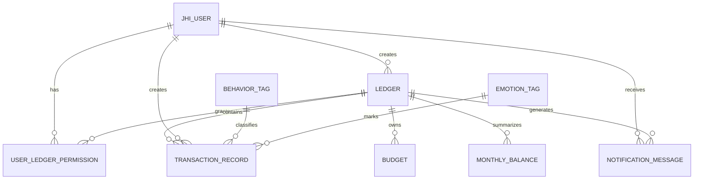

# EveryCent 数据库设计说明

本文档按根目录 `EveryCent_系统详细设计文档.md` 第 7 章数据库建模设计落地。项目复用 JHipster 内置 `jhi_user`、`jhi_authority`、`jhi_user_authority`，不重新创建用户表。

## 当前数据库开发状态

- JHipster 初始表已存在：`jhi_user`、`jhi_authority`、`jhi_user_authority`。
- 当前项目没有 `.jhipster/` 实体定义目录，因此业务模型采用手写 JPA 实体、Repository 和 Liquibase changelog。
- 业务表 changelog：`src/main/resources/config/liquibase/changelog/20260615000100_add_everycent_business_tables.xml`。
- `master.xml` 已 include 该 changelog。

## E-R 实体说明

## 核心表

### ledger

账本表。字段：`id`、`name`、`description`、`creator_id`、`default_currency`、`current_month_balance`、`created_date`、`last_modified_date`。

约束：`creator_id` 外键关联 `jhi_user.id`；`name`、`creator_id`、`default_currency`、`current_month_balance`、`created_date` 非空。

### user_ledger_permission

用户账本权限表。字段：`id`、`user_id`、`ledger_id`、`permission_level`、`status`、`invited_by_id`、`created_date`。

约束：`user_id` 外键关联 `jhi_user.id`；`ledger_id` 外键关联 `ledger.id`；`invited_by_id` 外键关联 `jhi_user.id`；`(user_id, ledger_id)` 唯一。

权限枚举：`OWNER`、`READ_WRITE`、`READ_ONLY`。状态枚举：`ACTIVE`、`PENDING`、`REVOKED`。

### transaction_record

收支记录表。字段：`id`、`ledger_id`、`creator_id`、`amount`、`type`、`behavior_tag_id`、`emotion_tag_id`、`transaction_date`、`source`、`description`、`raw_input`、`created_date`、`last_modified_date`。

约束：`ledger_id` 外键关联 `ledger.id`；`creator_id` 外键关联 `jhi_user.id`；`behavior_tag_id` 外键关联 `behavior_tag.id`；`emotion_tag_id` 外键关联 `emotion_tag.id`；MySQL 下有 `amount > 0` check。实体层使用 `@DecimalMin("0.01")` 补充校验。

### behavior_tag

行为标签表。字段：`id`、`code`、`name`、`system_default`、`creator_id`。

约束：`code` 唯一且非空；`creator_id` 可为空并外键关联 `jhi_user.id`。系统默认标签通过 Liquibase 初始化：`FOOD`、`TRANSPORT`、`SHOPPING`、`ENTERTAINMENT`、`STUDY`、`MEDICAL`、`SALARY`、`PART_TIME`、`OTHER`。

### emotion_tag

情绪标签表。字段：`id`、`code`、`name`、`valence`、`system_default`、`creator_id`。

约束：`code` 唯一且非空；`valence` 非空；`creator_id` 可为空并外键关联 `jhi_user.id`。系统默认标签通过 Liquibase 初始化：`HAPPY`、`CALM`、`IMPULSIVE`、`ANXIOUS`、`REGRET`、`STRESSED`、`NONE`。

### budget

预算表。字段：`id`、`ledger_id`、`cycle`、`period_start`、`period_end`、`limit_amount`、`alert_threshold`、`enabled`。

约束：`ledger_id` 外键关联 `ledger.id`；`(ledger_id, cycle, period_start, period_end)` 唯一；MySQL 下有 `limit_amount > 0` 和 `alert_threshold between 0 and 1` check。

### monthly_balance

月度余额快照表。字段：`id`、`ledger_id`、`year`、`month`、`total_income`、`total_expense`、`balance`、`updated_date`。

约束：`ledger_id` 外键关联 `ledger.id`；`(ledger_id, year, month)` 唯一；MySQL 下有 `month between 1 and 12` check。

### notification_message

消息提醒表。字段：`id`、`user_id`、`ledger_id`、`budget_id`、`title`、`content`、`type`、`level`、`is_read`、`created_date`。

约束：`user_id` 外键关联 `jhi_user.id`；`ledger_id` 可为空并外键关联 `ledger.id`；`budget_id` 可为空并外键关联 `budget.id`。

## 3NF 分析

- 用户资料留在 JHipster `jhi_user`，业务表只保存用户外键。
- `user_ledger_permission` 独立保存账本授权关系，避免在 `ledger` 中存成员列表。
- `behavior_tag` 和 `emotion_tag` 独立成表，支持系统默认标签和用户自定义标签。
- `transaction_record` 保存单条收支事实，不保存预算使用率等派生值。
- `monthly_balance` 是缓存快照，可由 `transaction_record` 重算，不作为真实流水来源。

## 设计原因

权限表用于支持多人共享账本。`OWNER` 可管理账本和成员，`READ_WRITE` 可共同记账，`READ_ONLY` 只允许查看，适合家庭监督场景。

预算表使用 `period_start` 和 `period_end`，与系统详细设计文档和 API DTO 保持一致，后端可以直接按日期范围计算预算使用情况。

收支记录表使用 `transaction_record`，避免使用 `transaction` 作为表名或类名。`source` 用于区分手工录入和自然语言录入结果，但 LLM 结果必须经过后端校验后才能入库。

月度余额可以通过数据库触发器或 Service 层更新。当前只建立 `monthly_balance` 表和约束，建议先由 `TransactionRecordService` 在新增、修改、删除记录后调用汇总服务重算，后续如需触发器再新增 changelog。

## 风险控制

- 数据库层已实现主键、外键、唯一、非空、常用索引和 MySQL check 约束。
- 只读权限、写权限、所有者权限必须在后端 Service/Resource 层校验。
- 标签入库应校验 `behavior_tag.code` 和 `emotion_tag.code` 是否存在。
- 测试演示数据不写入正式 changelog，避免污染真实数据库。
